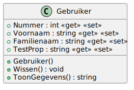

# 01_00

## Klassen

### Gebruiker

**Methode `Wissen`**

Deze methode zet de waarde van de nummer op 0. De waarde van voornaam en familienaam wordt een lege string.

**Methode `ToonGegevens`**

Deze methode retourneert een tekstuele weergave van het object: `<Nummer> - <Voornaam> <Familienaam>`

## Console applicatie

Maak een console applicatie die de gebruiker vraagt om een nummer, voornaam en familienaam in te geven. Maak een object van de klasse `Gebruiker` en toon de gegevens van de gebruiker. 