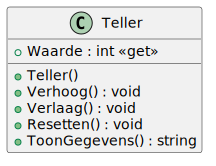

# 01_01

## Klassen

### Teller



**Methode `Verhoog`**

Deze methode verhoogt de waarde van de teller met 1.

**Methode `Verlaag`**

Deze methode verlaagt de waarde van de teller met 1.

**Methode `Resetten`**

Deze methode zet de waarde van de teller op 0.

**Methode `ToonGegevens`**

Deze methode retourneert een tekstuele weergave van het object: `De waarde van de teller is <waarde>`.

## Console applicatie

Maak een console applicatie die de gebruiker vraagt om een keuze te maken. De mogelijke keuzes vind je hieronder:

- 0: Stoppen
- 1: Verhogen
- 2: Verlagen
- 3: Resetten

Indien de gebruiker kiest voor 1, 2 of 3 voer je de betreffende methode uit op het teller-object. Indien de gebruiker kiest voor 0, stopt de applicatie en toon je de waarde van de teller. Na elke keuze en actie krijgt de gebruiker opnieuw de mogelijkheid om een keuze te maken tot er 0 gekozen wordt.

### Voorbeeld

```plaintext
Maak een keuze: 1
Maak een keuze: 1
Maak een keuze: 2
Maak een keuze: 0

De waarde van de teller is 1
```