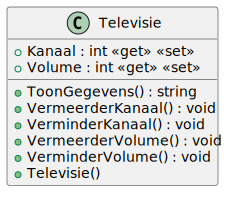

# 01_02

## Klassen

### Televisie



- Het kanaal kan niet kleiner worden dan 1 of groter dan 30.
- Het volume kan niet kleiner worden dan 0 of groter dan 10.
- Standaardwaarde voor het kanaal is 1. 
- Standaaardwaarde voor het volume is 5.

## Console applicatie

Maak een console applicatie waar de gebruiker een tv kan configureren. Bij het starten van de applicatie wordt er een televisie-object aangemaakt.

De gebruiker kan nu kiezen om het kanaal of volume te verhogen of te verlagen adhv volgende opties:

- 1: Kanaal verhogen
- 2: Kanaal verlagen
- 3: Volume verhogen
- 4: Volume verlagen
- 5: Stoppen

Hij kan keuzes blijven maken tot hij 5 kiest.

Wanneer de gebruiker 5 kiest, toon je de huidige configuratie van de televisie en sluit je de applicatie af.

### Voorbeeld

```plaintext
Startconfiguratie: Kanaal: 1 - Volume 5
Maak een keuze: 1
Maak een keuze: 1
Maak een keuze: 1
Maak een keuze: 3
Maak een keuze: 3
Maak een keuze: 5

Huidige configuratie: Kanaal: 4 - Volume 7
```