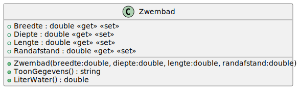

# 01_04

## Klassen

### Zwembad



**Property `Breedte`**

De breedte van het zwembad. Deze mag niet kleiner zijn dan 0. Bij een foutieve waarde wordt de breedte ingesteld op 0.

**Property `Diepte`**

De diepte van het zwembad. Deze mag niet kleiner zijn dan 0. Bij een foutieve waarde wordt de diepte ingesteld op 0.

**Property `Lengte`**

De lengte van het zwembad. Deze mag niet kleiner zijn dan 0. Bij een foutieve waarde wordt de lengte ingesteld op 0.

**Property `Randafstand`**

De randafstand van het zwembad. Deze mag niet kleiner zijn dan 0 en niet groter dan de diepte. Bij een foutieve waarde wordt de randafstand ingesteld op 0.

**Methode `LiterWater`**

Deze methode berekent de hoeveelheid water die nodig is om het zwembad te vullen. De formule hiervoor is: `Breedte * (Diepte - Randafstand) * Lengte * 1000`.

**Methode `ToonGegevens`**

Deze methode retourneert een tekstuele weergave van het object:

```plaintext
Diepte = <Diepte>
Breedte = <Breedte>
Lengte = <Lengte>
Randafstand = <Randafstand>

Liters water = <LitersWater>
```

### Console applicatie

Maak een console applicatie die de gebruiker vraagt om een breedte, lengte, diepte en randafstand in te geven in de volgorde zoals hier beschreven. Voorzie de correcte controles. Nadat de gebruiker deze gegevens heeft ingegeven, toon je de gegevens van het zwembad en sluit de applicatie af.

*De oplossing voor deze opdracht [vind je hier](https://gitpub.sebastiaanh.com/public/web/f02e8d40-aa4c-4a61-9c14-1d46138f6902)*