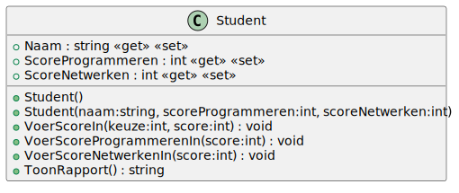

# 02_00

## Klassen

### Student



**Property `ScoreProgrammeren`**

Deze mag niet kleiner zijn dan 0. Bij een waarde kleiner dan 0, zal 0 ingesteld worden.
Deze mag niet groter zijn dan 20. Bij een waarde groter dan 20, zal 20 ingesteld worden.

**Property `ScoreNetwerken`**

Deze mag niet kleiner zijn dan 0. Bij een waarde kleiner dan 0, zal 0 ingesteld worden.
Deze mag niet groter zijn dan 20. Bij een waarde groter dan 20, zal 20 ingesteld worden.

**Methode `VoerScoreIn`**

De eerste parameter zal aangeven of de score voor programmeren of netwerken ingevoerd wordt. (0 = programmeren, 1 = netwerken)
De tweede parameter is de behaalde score

**Methode `ToonRapport`**

Deze methode retourneert een tekstuele weergave van het object:

```
<Naam>
------
Programmeren: <ScoreProgrammeren>
Netwerken: <ScoreNetwerken>
Proficiat u bent geslaagd! (Indien beide scores 10 of hoger)
Helaas u bent niet geslaagd! (Indien minimaal 1 score onder 10)
```

## Console applicatie
Maak een console applicatie die de gegevens van een student inleest.
Zorg voor een output die er als volgt uit ziet:

```plaintext
Geef een naam: Piet
Geef een score voor programmeren: 15
Geef een score voor netwerken: 8

Piet
------
Programmeren: 15
Netwerken: 8
Helaas u bent niet geslaagd!
```