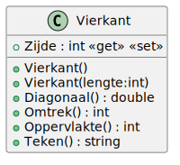

# 02_01

## Klassen

### Vierkant



**Property `Zijde`**

- De zijde mag niet kleiner zijn dan 0. Bij een waarde kleiner dan 0, zal 0 ingesteld worden.
- De zijde mag niet groter zijn dan 25. Bij een waarde groter dan 25, zal 25 ingesteld worden.

**Methode `Oppervlakte`**

Deze methode retourneert de oppervlakte van het vierkant. Wordt berekend door de zijde te vermenigvuldigen met zichzelf.

**Methode `Omtrek`**

Deze methode retourneert de omtrek van het vierkant. Wordt berekend door de zijde te vermenigvuldigen met 4.

**Methode `Diagonaal`**

Deze methode retourneert de lengte van de diagonaal van het vierkant. Wordt berekend door de zijde te vermenigvuldigen met de wortel van 2. Rond af tot op 2 cijfers na de komma. Gebruik hiervoor de methode `Math.Round`.

**Methode `Teken`**

Deze methode maakt onder de vorm van een sterretjesmatrix een vierkant met de opgegeven zijde. Een voorbeeld met zijde = 3:
```
* * *
* * *
* * *
```

## Console applicatie

Maak een console applicatie die de zijde van een vierkant inleest. Zorg voor een output die er als volgt uit ziet:

```plaintext
Geef de zijde van het vierkant: 5

Teken:
* * * * *
* * * * *
* * * * *
* * * * *
* * * * *

Omtrek: 20
Oppervlakte: 25
Diagonaal: 7,07
```