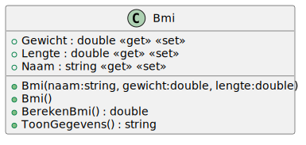

# 02_02

## Klassen

### Bmi



**Methode `BerekenBmi`**

Deze methode berekent de Body Mass Index (BMI) van een persoon. De BMI wordt berekend door het gewicht in kilogram te delen door het kwadraat van de lengte in meter. Rond af tot op 1 cijfer na de komma. Gebruik hiervoor de methode `Math.Round`.

## Console applicatie

Schrijf een programma dat de naam, lengte en gewicht van een persoon inleest. Bereken de BMI en toon de gegevens van de persoon. De output ziet er als volgt uit:

```
Geef een naam: Jan
Geef een gewicht: 67
Geef een lengte: 1,8

Jan weegt 67 kg en is 1,8 m groot. De BMI is 20,7.
```