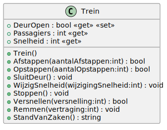

# 02_04

## Klassen

### Trein



- Het aantal passagiers kan niet kleiner zijn dan 0. Bij een foutieve waarde, wordt 0 ingesteld.
- De snelheid kan niet groter zijn dan 120 en niet kleiner zijn dan 0. Bij een foutieve nieuwe waarde kleiner dan 0, zal 0 ingesteld worden. Bij foutieve nieuwe waarde groter dan 120, wordt 120 ingesteld.
- Enkel als de deuren open staan, zal bij het afstappen het aantal Passagiers verminderd worden. Voorzie een returnwaarde die true is als passagiers kunnen afstappen.
- Enkel als de deuren open staan, zal bij het opstappen het aantal passagiers vermeerderd worden. Voorzie een returnwaarde die true is als passagiers kunnen opstappen.
- Alle snelheidsveranderingen (versnellen, vertragen, remmen, stoppen) worden geregeld via de methode WijzigSnelheid. Deze past de snelheid aan (maw maakt gebruik van de property Snelheid).
Bij het stoppen wordt de snelheid op 0 gebracht. Deze snelheidswijziging gebeurt adhv de methode WijzigSnelheid. De deuren gaan open.
- Enkel als de deuren toe zijn, kan de snelheid vermeerderd worden met de versnelling. Deze snelheidswijziging gebeurt adhv de methode WijzigSnelheid. Voorzie een returnwaarde die true is als de trein is kunnen versnellen.
- Bij het remmen wordt de snelheid verminderd met de vertraging. Deze snelheidswijziging gebeurt a.d.h.v. de methode WijzigSnelheid.
- Geef via de methode StandVanZaken een tekstuele voorstelling van alle eigenschappen

## Console applicatie

Schrijf een programma waarmee de gebruiker de gegevens behorende tot een trein kan beheren. De gebruiker zal vanaf het opstarten steeds de keuze krijgen uit een menu om zijn actie met betrekking tot de trein te bepalen. Hierna word telkens een stand van zaken getoond. Dit proces blijft lopen tot de gebruiker de stop optie kiest uit het keuzemenu.

### Voorbeelden

```plaintext
Opties
---------------
0. Applicatie stoppen
1. Versnellen (50 km/uur)
2. Vertragen (50 km/uur)
3. Trein stoppen
4. Deuren sluiten
5. Passagier laten afstappen
6. Passagier laten opstappen

Geef een keuze: 5

Snelheid: 0
Passagiers: 1
Deuren: Open
```

```plaintext
Opties
---------------
0. Applicatie stoppen
1. Versnellen (50 km/uur)
2. Vertragen (50 km/uur)
3. Trein stoppen
4. Deuren sluiten
5. Passagier laten afstappen
6. Passagier laten opstappen

Geef een keuze: 4

Snelheid: 0
Passagiers: 1
Deuren: Gesloten
```

```plaintext
Opties
---------------
0. Applicatie stoppen
1. Versnellen (50 km/uur)
2. Vertragen (50 km/uur)
3. Trein stoppen
4. Deuren sluiten
5. Passagier laten afstappen
6. Passagier laten opstappen

Geef een keuze: 4

Snelheid: 50
Passagiers: 1
Deuren: Gesloten
```