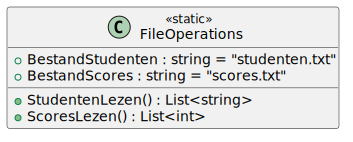

# 03_00

## klasse

### FileOperations



**Statische property `BestandStudenten`**
Dit attribuut bevat de bestandsnaam waaruit de studenten kunnen uitgelezen worden. De waarde is "studenten.txt". Voorzie dat dit bestand in je project is opgenomen.

**Statische property `BestandScores`**
Dit attribuut bevat de bestandsnaam waaruit de scores kunnen uitgelezen worden. De waarde is "scores.txt". Voorzie dat dit bestand in je project is opgenomen.

**Statische methode `StudentenLezen`**
Deze methode zal de studenten uitlezen aan de hand van de bestandsnaam via het statische attriubuut BestandStudenten.

**Statische methode `ScoresLezen`**
Deze methode zal de scores uitlezen aan de hand van de bestandsnaam via het statische attriubuut BestandScores.

## Console applicatie
*Maak gebruik van bestanden ``studenten.txt` en `scores.txt`*

Bij het opstarten van de applicatie krijgt de gebruiker een menu met opties waaruit deze kan kiezen.

Bij het ingeven van een 0 of 1 krijgt de gebruiker een lijst met de studenten of scores die uit de respectievelijke bestanden gehaald worden door de methodes van FileOperations.
Bij het ingeven van een 2 krijgt de gebruiker een lijst te zien waarbij de studenten en scores gecombineerd worden. Je kan hier dezelfde index voor gebruiken in beide lijsten.
Een regel ziet er als volgt uit: <student> (<score>)

### Voorbeelden:

Input:
```
Opties
------

0. Studenten
1. Scores
2. Studenten met scores

Geef een keuze: 0
```


Output:
```
Studenten
---------

Jan klaas
Koen Vermeulen
Vince Gijs
Goedele Dekkers
Dries Hendriks
Charlotte Van Leeuwen
Sara Bos
```

Input:
```
Opties
------

0. Studenten
1. Scores
2. Studenten met scores

Geef een keuze: 2
```

Output:
```
Studenten met scores
---------

Jan klaas (14)
Koen Vermeulen (15)
Vince Gijs (20)
Goedele Dekkers (8)
Dries Hendriks (12)
Charlotte Van Leeuwen (4)
Sara Bos (1)
```