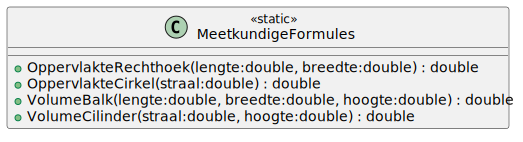

# 03_01

## klasse

### MeetkundigeFormules



**Statische methode `OppervlakteRechthoek`**
Deze methode zal de oppervlakte van een rechthoek berekenen aan de hand van de meegegeven lengte en breedte.
De formule hiervoor is: `<lengte> * <breedte>`

**Statische methode `OppervlakteCirkel`**
Deze methode zal de oppervlakte van een cirkel berekenen aan de hand van de meegegeven straal.
De formule hiervoor is: `π * <straal>²`

**Statische methode `VolumeBalk`**
Deze methode zal de volume van een balk berekenen aan de hand van de meegegeven lengte, breedte en hoogte.
De formule hiervoor is: `<lengte> * <breedte> * <hoogte>`

**Statische methode `VolumeCilinder`**
Deze methode zal de volume van een cilinder berekenen aan de hand van de meegegeven straal en hoogte.
De formule hiervoor is: `π * <straal>² * <hoogte>`


## Console applicatie
Bij het opstarten van de applicatie krijgt de gebruiker een menu met opties waaruit deze kan kiezen. Bij het ingeven van de optie worden vervolgens de juiste benodigde gegevens gevraagd. Hierna word het resultaat getoond.


### Voorbeelden:

Input:
```
Opties
------

0. Oppervlakte rechthoek
1. Oppervlakte cirkel
2. Volume balk
3. Volume cilinder

Geef een optie: 1

Geef een straal: 5
```

Output
```
De oppervlakte van de cirkel is: 78,5 cm²
```

Input:
```
Opties
------

0. Oppervlakte rechthoek
1. Oppervlakte cirkel
2. Volume balk
3. Volume cilinder

Geef een optie: 2

Geef een lengte: 5
Geef een breedte: 10
Geef een hoogte: 7
```

Output
```
De volume van de balk is: 350 cm3
```