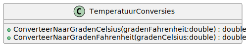
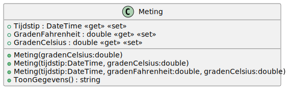

# 03_02

## klassen

### TemperatuurConversies



**Statische methode `ConverteerNaarGradenCelsius`**
Deze methode moet graden Celsius berekenen aan de hand van de meegegeven graden Fahrenheit.
De formule hiervoor is: (<gradenFahrenheit> - 32) * 5 / 9.
**Statische methode `ConverteerNaarGradenFahrenheit`**
Deze methode moet graden Fahrenheit berekenen aan de hand van de meegegeven graden Celsius.
De formule hiervoor is: (<gradenCelsius> x 9 / 5) + 32.

### Meting



- Voorzie 3 constructors waarbij men de juiste gebruikt aan de hand van de beschikbare gegevens.
    - Een missende graden Fahrenheit zal berekend worden met de gegeven graden Celcius.
    - Een missend tijdstip zal ingevuld worden met het huidige moment

## Console applicatie
Bij het opstarten van het programma, worden respectievelijk het tijdstip, graden in Celsius en graden in Fahrenheit opgevraagd voor een meting. Bij het tijdstip en graden in Fahrenheit kan een lege waarde ingevuld worden. Bij graden in Celsius blijft de applicatie naar een waarde vragen tot een correct kommagetal ingevoerd wordt. Afhankelijk van de ingevulde gegevens word via de correcte contstructor een instantie van meting aangemaakt. Daarna worden de gegevens van de meting getoond.

Input:
```
Geef aantal graden Celcius: 5
Geef aantal graden Fahrenheit: 
Geef een tijdstip: 22/11/2022 12:30
```

Output:
```
Meting
------

Op 20/11/2022 12:30 werd er 5 graden Celsius en 41 graden Fahrenheit gemeten.
```