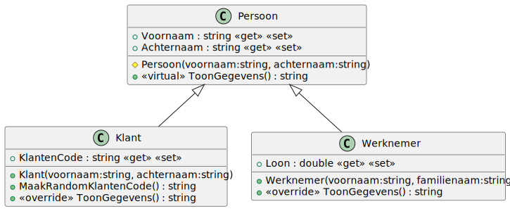
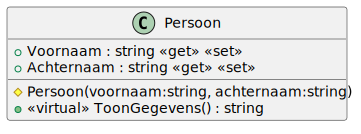
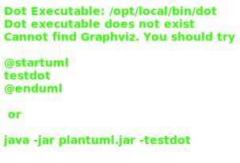
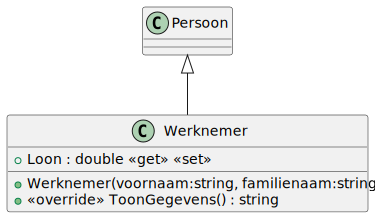

# 04_00

## klassen

### Overzicht



### Persoon



**Methode `ToonGegevens()`**
Geeft de tekstuele voorstelling van het object als volgt
`Mijn naam is <Voornaam> <Achternaam>`

### Klant



**Methode `ToonGegevens()`**
Geeft de tekstuele voorstelling van het object als volgt
`Mijn naam is <Voornaam> <Achternaam> mijn klanten code: <KlantenCode>`.

**Methode `MaakRandomKlantenCode`**
Deze methode zal een klantencode maken bestaande uit de initialen van de klant gevolgd door een willkeurig getal tussen 0 en 1000. Zorg er voor dat het getal telkens uit 4 cijfers bestaat. Bijvoorbeeld: `JS0050 (John Smith met getal 50).`

**Constructor**
De klantencode wordt ingevuld met een willekeurige klantencode. Maak gebruik van de methode MaakRandomKlantenCode().


### Werknemer



**Methode `ToonGegevens()`**
Geeft de tekstuele voorstelling van het object als volgt
`Mijn naam is <Voornaam> <Achternaam> en ik verdien <Loon> euro per uur.`

**Constructor**
Het loon wordt bij een nieuwe werknemer ingesteld op 10,20 euro.


## Console applicatie
Maak een nieuwe werknemer en klant aan. Geef de werknemer en klant een voor-/achternaam. Print de gegevens van de werknemer en de klant in console via de methode ToonGegevens().

Voorbeeld:
```
Beste werknemer geef je voornaam: John
Beste werknemer geef je achternaam: Doe

Mijn naam is John Doe en ik verdien 10,20 euro per uur.

Beste klant geef je voornaam: John
Beste klant geef je achternaam: Doe

Mijn naam is John Doe mijn klanten code: JD0152.
```

De klantencode in bovenstaand voorbeeld is random. Deze kan dus verschillen in jouw applicatie.