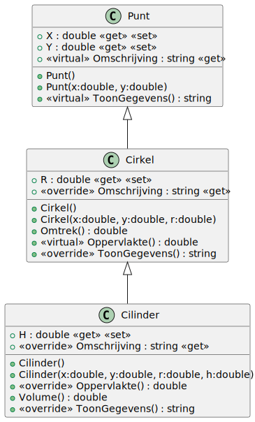
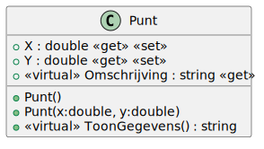
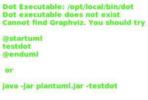
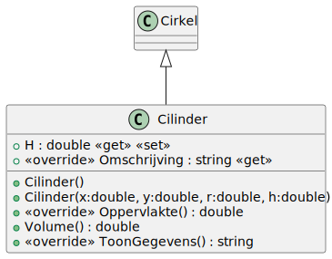

# 04_01

## Klassen

### Overzicht



### Punt



**Property `Omschrijving`**
Dit geeft als returnwaarde de tekstuele waarde `<klassenaam>:coord=(<X>,<Y>)` Tip: De klassenaam is op te vragen door de methode this.GetType().Name
**Methode `ToonGegevens()`**
Returnwaarde is de omschrijving.

### Cirkel



**Property `Omschrijving`**
Dit geeft als returnwaarde de waarde
`<klassenaam>:coord=(<X>,<Y>) straal <R>`
Tip: De klassenaam is op te vragen door de methode this.GetType().Name

**Methode `Omtrek()`**
Returnwaarde is de omtrek van de cirkel
Formule: `2 * π * r`. Rond af tot 2 cijfers na de komma adhv Math.Round().

**Methode `Oppervlakte()`**
Returnwaarde is de oppervlakte van de cirkel
Formule: `π * r²`. Rond af tot 2 cijfers na de komma adhv Math.Round().

**Methode `ToonGegevens()`**
Geeft de tekstuele voorstelling van het object als volgt
`<klassenaam>:coord=(<X>,<Y>) straal <R>
Oppervlakte: <Oppervlakte>
Omtrek: <Omtrek>`
Maak gebruik van de property Omschrijving!

### Cilinder



**Property `Omschrijving`**
Dit geeft als returnwaarde de waarde
`<klassenaam>:coord=(<X>,<Y>) straal <R>, hoogte<H>`
Tip: De klassenaam is op te vragen door de methode this.GetType().Name

**Methode `Volume()`**
Berekent het volume van de cilinder
Formule = `π * r² * h`
Maak gebruik van de oppervlakte van de cirkel die in de klasse Cirkel is aangemaakt

**Methode `Oppervlakte()`**
Berekent de oppervlakte van de cilinder
Formule = `2 * π * r² + 2 * π * r * h`
Maak in de formule gebruik van de oppervlakte en de omtrek die in de klasse Cirkel is aangemaakt

**Methode `ToonGegevens()`**
Geeft de tekstuele voorstelling van het object als volgt
`<klassenaam>:coord=(<X>,<Y>) straal <R>, hoogte<H>
Oppervlakte: <Oppervlakte>
Volume: <Volume>`
Maak gebruik van de property Omschrijving!

## Console applicatie
Bij het opstarten van de applicatie krijgt de gebruiker een menu met de volgende opties:
```
0. Punt
1. Cirkel
2. Cilinder
```

Afhankelijk van de keuze, worden de benodigde gegevens opgevraagd. Ingegeven waardes moeten numeriek zijn en groter dan 0. Hierna word een object aangemaakt met opgevraagde waardes en word deze vervolgens getoond.

Enkele voorbeelden:
```
0. Punt
1. Cirkel
2. Cilinder
Maak uw keuze: 0
Geef een getal groter dan 0 voor X: 3
Geef een getal groter dan 0 voor Y: 4
Punt: coord=(3,4)
```

```
0. Punt
1. Cirkel
2. Cilinder
Maak uw keuze: 1
Geef een getal groter dan 0 voor X: 3
Geef een getal groter dan 0 voor Y: 4
Geef een getal groter dan 0 voor R: 5
Cirkel: coord=(3,4) straal 5
Oppervlakte: 78,54
Omtrek: 31,42
```

```
0. Punt
1. Cirkel
2. Cilinder
Maak uw keuze: 2
Geef een getal groter dan 0 voor X: 3
Geef een getal groter dan 0 voor Y: 4
Geef een getal groter dan 0 voor R: 5
Geef een getal groter dan 0 voor H: 6
Cilinder: coord=(3,4) straal 5, hoogte = 6
Oppervlakte: 345,60
Volume: 471,24
```