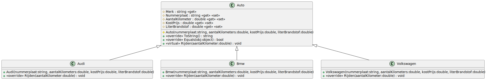
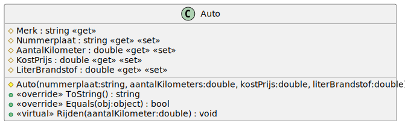
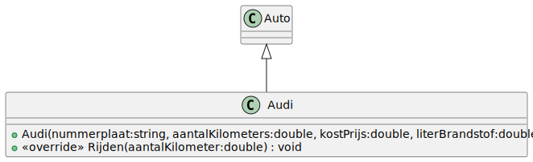
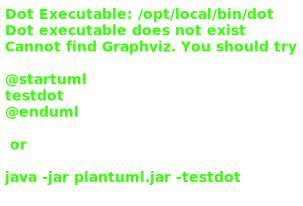

# 05_00

## Klassen



### Auto

**Methode `ToString()`**
Geeft de tekstuele voorstelling van het object als volgt:
Ik ben een <Merk> met nummerplaat <Nummerplaat> (<AantalKilometer> km - <LiterBrandstof> liter)
Kostprijs: <Kostprijs> euro

**Property `Merk`**
Dit geeft als returnwaarde de tekstuele waarde
<klassenaam>
Tip: De klassenaam is op te vragen door de methode this.GetType().Name

**Methode `Equals(Object obj)`**
Een auto is gelijk aan een andere kaart als beide een van het type auto zijn alsook dezelfde nummerplaat bevatten.

**Methode `Rijden(double aantalKilometer)`**
Deze methode zal kilometers toevoegen aan het totale aantal en vervolgens de hoeveelheid brandstof verrekenen waarbij er bij 20 kilometer 1 liter verbruikt is.

### Audi

**Constructor**
Maak gebruik van de constructor van de superklasse.
**Methode `Rijden(double aantalKilometer)`**
Deze methode zal kilometers toevoegen aan het totale aantal en vervolgens de hoeveelheid brandstof verrekenen waarbij er bij 15 kilometer 1 liter verbruikt is.

### BMW

**Constructor**
Maak gebruik van de constructor van de superklasse.
**Methode `Rijden(double aantalKilometer)`**
Deze methode zal kilometers toevoegen aan het totale aantal en vervolgens de hoeveelheid brandstof verrekenen waarbij er bij 20 kilometer 1 liter verbruikt is.


### Volkswagen

**Constructor**
Maak gebruik van de constructor van de superklasse.
**Methode `Rijden(double aantalKilometer)`**
Deze methode zal kilometers toevoegen aan het totale aantal en vervolgens de hoeveelheid brandstof verrekenen waarbij er bij 25 kilometer 1 liter verbruikt is.

## Console applicatie
Bij het opstarten van de applicatie, kan de gebruiker 1 van de auto's kiezen om acties op uit te voeren. Hierna wordt gevraagt welke actie zij willen uitvoeren. Hierbij worden de juiste gegevens opgevraagd om deze actie uit te voeren. De applicatie blijft actief tot optie 0 gekozen word.

Maak volgende auto's aan:

- Audi met nummerplaat 1-lvn-568, 25000 km en 25 liter brandstof. Kostprijs: 7500 euro.
- Volkswagen met nummerplaat 1-sej-454, 100000 km en 10 liter brandstof. Kostprijs: 5500 euro.
- Bmw met nummerplaat 1-hbj-298, 500 km en 44 liter brandstof. Kostprijs: 12500 euro.

### Voorbeeld:
```
Auto's
------
0. Stoppen
1. Audi (1-lvn-568)
2. Volkswagen (1-sej-454)
3. Bmw (1-hbj-298)

Kies een auto: 1

Acties
------
0. Testrit maken
1. Details tonen

Kies een actie: 0

Geef aantal kilometer: 50

Kies een auto: 
```