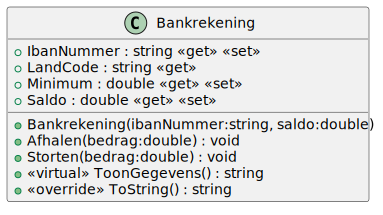
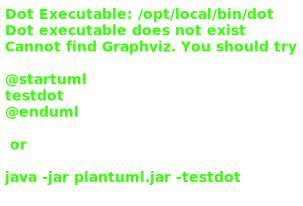
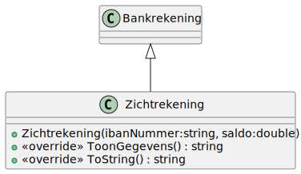

# 05_01

Deze oefening is een uitbreiding op oefening 04.02

## Klassen


### Bankrekening



**Methode `ToString()`**

Geeft de tekstuele voorstelling van het object als volgt
<IbanNummer> -> Je huidig saldo bedraagt: <Saldo> euro.

### Spaarrekening



**Constructor**

Het percentage krijgt eens standaardwaarde van 15

**Methode `ToString()`**

Geeft de tekstuele voorstelling van het object als volgt <IbanNummer> -> Je huidig saldo bedraagt: <Saldo> euro.
De rentevoet bedraagt: <Percentage>%.

### Zichtrekening



**Methode `ToString()`**

Geeft de tekstuele voorstelling van het object als volgt
<IbanNummer> -> Je hudig saldo bedraagt: <Saldo> euro.
Het minimumbedrag bedraagt: <Minimum> euro.

## Console applicatie

Bij het opstarten van de applicatie krijgt de gebruiker een menu met de volgende opties:

```
1. Spaarrekening
2. Zichtrekening
```

Afhankelijk van de keuze wordt er een respectievelijk object aangemaakt.

De gebruiker krijgt dan 4 opties:

```
1. Afhalen
2. Storten
3. Schrijf rente bij
4. Informatie
```

### Optie `Afhalen`

Vraag hoeveel de gebruiker wil afhalen. Als het bedrag kleiner of gelijk is aan 0, tonen we: "Het af te halen bedrag moet groter zijn dan 0".

Het saldo mag niet onder het minumum komen. Indien dit het geval zou zijn tonen we: "Je hebt niet genoeg saldo om deze opdracht te verwerken...".

Als bovenstaande creteria niet het geval zijn, halen we het bedrag van ons saldo.

### Optie `Storten`

Vraag hoeveel de gebruiker wil storten. Als het bedrag kleiner of gelijk is aan 0, tonen we: "Het te storten bedrag moet groter zijn dan 0". Als bovenstaande creteria niet het geval zijn, storten we het bedrag bij ons saldo.

### Optie `Schrijf rente bij`

Rente bijschrijven kan alleen als de rekening van het type Spaarrekening is.

Is dat niet het geval dan tonen we: "Deze optie is alleen beschikbaar bij een spaarrekening..."

### Optie `Informatie`

Toon een tekstuele waarde van de rekening. Gebruik hiervoor de ToString() methode.

De applicatie sluit af na deze operatie.

### Voorbeelden

```
1. Spaarrekening
2. Zichtrekening

Kies een optie: 2
1. Afhalen
2. Storten
3. Schijf rente bij
4. Informatie      

Kies een optie: 2  
Hoeveel wil je storten? 1000
1. Afhalen
2. Storten
3. Schijf rente bij
4. Informatie

Kies een optie: 1
Hoeveel wil je afhalen? 200
1. Afhalen
2. Storten
3. Schijf rente bij
4. Informatie

Kies een optie: 4
BE12 3456 7890 1234 -> Je huidig saldo bedraagt 800 euro
Het minimumbedrag bedraagt: -100 euro
```

```
1. Spaarrekening
2. Zichtrekening

Kies een optie: 1
1. Afhalen
2. Storten
3. Schijf rente bij
4. Informatie      

Kies een optie: 2  
Hoeveel wil je storten? 1000
1. Afhalen
2. Storten
3. Schijf rente bij
4. Informatie      

Kies een optie: 3  
1. Afhalen
2. Storten
3. Schijf rente bij
4. Informatie      

Kies een optie: 3  
1. Afhalen
2. Storten
3. Schijf rente bij
4. Informatie      

Kies een optie: 4  
BE12 3456 7890 1234 -> Je huidig saldo bedraagt 1322,5 euro
De rentevoet bedraagt: 15%
```