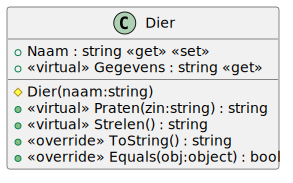
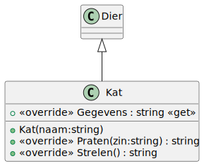
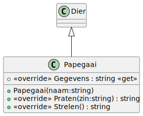
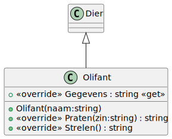

# 05_02

## Klassen


### Dier



- De gegevens van een dier worden als volgende tekstuele waarde weergegeven:
Mijn naam is <Naam> en ik ben een <klassenaam>.
- De methode ToString() geeft de gegevens van het dier weer.
- Dieren zijn hetzelfde wanneer het type en naamgeving overeenkomt.
- Wanneer een dier gestreeld wordt, zal er geen geluid gemaakt worden.
- Wanneer een dier praat, zal er geen geluid gemaakt worden. De geluiden van het strelen en praten wordt specifiek per dier bepaald.

### Kat



- De gegevens van een kat worden als volgende tekstuele waarde weergegeven:
Mijn naam is <Naam> en ik ben een <klassenaam>. Miauw! Miauw!
- Wanneer een kat gestreeld wordt, zal deze "RRR! RRRR! RRRRRRRR!" als geluid maken.
- Wanneer een kat praat, zal deze "MAAAUWWW!" als geluid maken

### Papegaai



- De gegevens van een papegaai worden als volgende tekstuele waarde weergegeven:
Mijn naam is <Naam> en ik ben een <klassenaam>. Krahh, Krahh! Wipo!
- Wanneer een papegaai gestreeld wordt, zal deze "Koko! koko! kokoooohh!" als geluid maken.
- Wanneer een papegaai praat, zal deze "Krahh! <zin>" als geluid maken.

### Olifant



- De gegevens van een olifant worden als volgende tekstuele waarde weergegeven:
Mijn naam is <Naam> en ik ben een <klassenaam>. Pfwww! STOMP!
- Wanneer een olifant gestreeld wordt, zal deze "STOMP! STOMP! STOMP!" als geluid maken.
- Wanneer een olifant praat, zal deze "Pfwwwwwww!" als geluid maken.

Tip: Kopieer de geluiden om spelfouten te vermijden.

## Console applicaties

Bij het opstarten van de applicatie krijgt de gebruiker een menu met de volgende opties:

```
1. Kat
2. Olifant
3. Papegaai
```
Er wordt een naam gevraagd voor het dier. Daarna wordt er een respectievelijk object aangemaakt.

De gebruiker krijgt dan 3 opties:

```
0. Gegevens
1. Strelen
2. Praten
```
De respectievelijke acties en geluiden worden weergegeven. Indien er gekozen wordt voor 'praten', vraag je de gebruiker om nog een zin in te geven.

De applicatie sluit af na deze operatie.

Enkele voorbeelden:
```
1. Kat
2. Olifant
3. Papegaai
Geef een getal tussen 1 en 3: 1
Geef een naam: Minoes
1. Gegevens
2. Praten
3. Strelen
Geef een getal tussen 1 en 3: 1
Mijn naam is Minoes en ik ben een Kat. Miauw! Miauw!
```
```
1. Kat
2. Olifant
3. Papegaai
Geef een getal tussen 1 en 3: 1
Geef een naam: Minoes
1. Gegevens
2. Praten
3. Strelen
Geef een getal tussen 1 en 3: 2
Wat wil je tegen het dier zeggen? Heb je honger?
MAAAUWWW!
```
```
1. Kat
2. Olifant
3. Papegaai
Geef een getal tussen 1 en 3: 1
Geef een naam: Minoes
1. Gegevens
2. Praten
3. Strelen
Geef een getal tussen 1 en 3: 3
RRR! RRRR! RRRRRRRR!
```