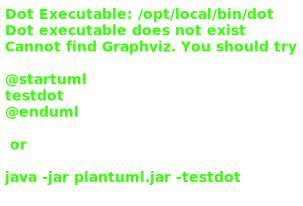
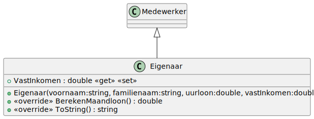
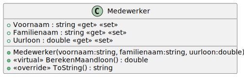

# 05_03

Maak een applicatie die het mogelijk maakt voor een winkelier om te berekenen wat zijn eigen inkomen is en dat van zijn medewerkers. Bekijk de voorbeelden voor de correcte werking. Het maandloon wordt berekend op basis van een werkweek van 40 uur, waarbij een maand 4 weken telt.





```
Kies een medewerker:
1. Medewerker
2. Eigenaar
1
Geef de voornaam: Joren
Geef de familienaam: Synaeve  
Geef het uurloon: 11
Joren Synaeve verdient 1760 euro per maand.
```

```
Kies een medewerker:
1. Medewerker
2. Eigenaar
2
Geef de voornaam: John
Geef de familienaam: Doe
Geef het uurloon: 11
Geef het vast inkomen: 1500
John Doe verdient 3260 euro per maand. Dit is ook de eigenaar en daarom is het loon hoger.
```
