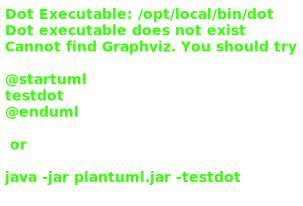
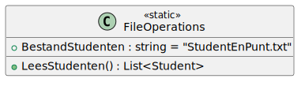
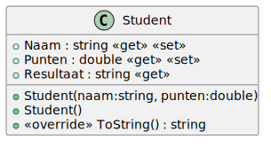

# 06_00





## Klasse

**Property `Naam`**
Deze property bevat de naam van de student die je uit het bestand haalt.

**Property `Punten`**
Deze property bevat het punt van de student die je uit het bestand haalt.

**Property `Resultaat`**
Deze property heeft enkel een getter en controleert of het punt kleiner of groter is dan 50. Als het punt kleiner is dan 50 krijgt de gebruiker "Niet geslaagd!" te zien. Als het punt groter dan of gelijk is aan 50, krijgt de gebruiker "Geslaagd!" te zien.

**Methode `ToString()`**
Deze methode print alle properties af. De output van deze methode is <Naam> <Score> <Resultaat>

## Console applicatie
Bij het opstarten van de applicatie krijgt de gebruiker een menu met de volgende opties:

```
Wat wil je doen?
----------------
1. Resultaat afdrukken
2. Afsluiten
```

Bij het ingeven van 1 krijgt de gebruiker een lijst te zien met de naam van de student, de score en of de student geslaagd is of niet. Het bestand wordt ingelezen via de methode ReadFile(string filename). Voorzie ook een methode die de keuze van de gebruiker gaat verwerken. Deze methode noem je ReadChoice(int choice) en gaat de lijst afdrukken of de applicatie afsluiten. Een regel ziet er als volgt uit: <Naam> <Score> <Resultaat>

```
StudentenEnPunt.txt
------

Mieke Vreys;89
Jef Ooms;78
Marie Leysen;56
Kristof Gheys;47
Greet Heyns;95
Sofie Leyns;75
Dirk Vanhemel;64
Jan Pittevils;51
Herman Brems;34
```