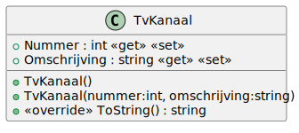

# 06_01



## Klasse

**Property `Nummer`**
Deze property bevat de nummer van het kanaal.

**Property `Omschrijving`**
Deze property bevat de omschrijving of naam van het kanaal.

**Property `ToString()`**
Deze methode geef een string terug met daarin "Nummer van het kanaal is <Nummer>

## Console applicatie
Bij het opstarten van de applicatie krijgt de gebruiker een menu met de volgende opties:

```
Een
Canvas
VTM
2BE
Vier

Van welk kanaal wil je het nummer tonen?
```

Bij het ingeven van een kanaal zorg je ervoor dat de gebruiker de juiste output krijgt. Als de gebruiker bijvoorbeeld 'VTM' ingeeft, wordt het volgende getoond:

```
Van welk kanaal wil je het nummer tonen? VTM

Nummer van het kanaal is 3
```

Maak een nieuwe lijst aan van de klasse TvKanaal. Vervolgens maak je 5 nieuwe objecten aan van deze klasse en die voeg je toe aan de lijst. Toon zoals in het voorbeeld alle kanalen en laat de gebruiker kiezen welk kanaal er getoond moet worden.