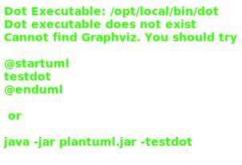

# 06_02

## Klassen



## Console applicatie

Bij het opstarten van de applicatie krijgt de gebruiker een menu met de volgende opties:

```plaintext
Cursisten
---------

1. Joske Vermeulen
2. Jef Ooms
3. Jan Janssens

Wat wil je doen?

0. Toevoegen
1. Verwijderen

Maak een keuze:
```

Als de gebruiker kiest voor 'Toevoegen', wordt het volgende scherm getoond:

```plaintext
Geef de voornaam van de nieuwe cursist:
Matthias
Geef de familienaam van de nieuwe cursist:
Claessen
```

Hierna wordt het scherm leeggemaakt en krijgt de gebruiker een bijgewerkte lijst te zien.

```plaintext
Nieuwe lijst van cursisten
--------------------------

1. Joske Vermeulen
2. Jef Ooms
3. Jan Janssens
4. Matthias Claessen

Druk op Enter om verder te gaan.
```

Als de gebruiker kiest voor 'Verwijderen', wordt het volgende scherm getoond:

```plaintext
Geef de cursistId van de cursist die je wil verwijderen:
```

Hier kan de gebruiker een getal ingeven dat getoond wordt voor de naam van de cursist. Als de gebruiker '2' ingeeft, dan wordt het scherm weer leeggemaakt en wordt er een bijgewerkte lijst getoond, net zoals bij 'Toevoegen'.

```plaintext
Nieuwe lijst van cursisten
--------------------------

1. Joske Vermeulen
2. Jan Janssens

Druk op Enter om verder te gaan.
```

Merk hier ook op dat de cursistId van 'Jan Janssens' bijgewerkt is van '3' naar '2'.

Voorzie in je Program.cs ook de volgende methodes:

**Methode `PrintOptions`**

Deze methode toont de 2 opties aan de gebruiker, namelijk 'Toevoegen' en 'Verwijderen'. Deze methode geeft een int terug met daarin de keuze die de gebruiker gemaakt heeft (0 of 1). Voorzie hier ook dat er gecontroleerd wordt of er effectief een getal ingegeven wordt.

**Methode `PrintCursisten`**

Deze methode print alle cursisten af. Aangezien we dit meerdere keren doen in onze applicatie, is het handig om deze code in een methode te steken.


