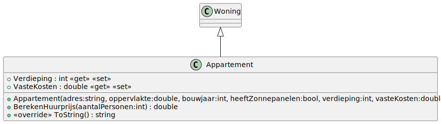

# 06_05

## Deel 1 - Klassen


### Woning


**Property `Info`**

Deze property is een samengestelde property die een tekstueel overzicht geeft. Een voorbeeld hiervan is `Appartement - 123 Urban Towers`.

Maak voor deze methode gebruik van `this.GetType().Name`.

**Methode `ToString`**

Deze methode geeft een ander tekstueel voorbeeld van de woning een voorbeeld hiervan is het volgende:

```plaintext
De woning gelegen te 123 Urban Towers heeft een oppervlakte van 150 vierkante meter en is gebouwd in 1995. Zonnepanelen zijn al aanwezig.
```

OF

```plaintext
De woning gelegen te 123 Urban Towers heeft een oppervlakte van 150 vierkante meter en is gebouwd in 1995. Zonnepanelen zijn niet aanwezig.
```

**Methode `Equals`**

Deze methode controleert of twee woningen hetzelfde zijn. Twee woningen zijn hetzelfde wanneer hun type en adres hetzelfde zijn.

### Huis


**Propery `GemiddeldeKameropervlakte`**

Deze proeprty is een readonly propery. Deze geeft de oppervlakte verdeeld over de verschillende kamers. (Oppervlakte/AantalKamers) 

**Methode `BerekenVerbruik`** 

Deze methode berekent het verbruik van de woning. Er word gewerkt met een startwaarde van 100 kWh. Hierbij wordt 100 kWh bijgeteld indien het bouwjaar voor 1970 ligt. Indien het er zonnepannelen aanwezig zijn, zal er 20 kWh minder verbruikt worden. Tenslotte wordt er nog per persoon 5 kWh bijgeteld.

**Methode `ToString`**

Deze methode geeft volgende tekstuele weergave van het huis:

```plaintext
De woning gelegen te 123 Main Street heeft een oppervlakte van 200 vierkante meter en is gebouwd in 1960. Zonnepanelen zijn al aanwezig.
Er zijn 4 kamers.
```

### Appartement



**Methode `BerekenHuurprijs`**

Deze methode berekent wat het zou kosten om met een aantal personen een appartement te huren. Men start vanuit de VasteKosten. Per verdieping stijgt de prijs met 50 euro en per persoon stijgt de prijs met 30 euro. 
Bijvoorbeeld: Een appartement heeft vaste kosten van 300 euro. Het appartement is gelegen op de 10de verdieping en er gaan 5 personen in wonen. De huurprijs is dan: 300 + (50 * 10) + (30 * 5) = 950 euro

**Methode `ToString`**

Deze methode geeft volgende tekstuele weergave van het appartement:

```plaintext
De woning gelegen te 123 Urban Towers heeft een oppervlakte van 150 vierkante meter en is gebouwd in 1995. Zonnepanelen zijn al aanwezig.
De vaste kosten voor dit appartement zijn 350 euro.
```

### FileOperations


**Property `BestandWoningen`**
    
Dit property wordt ingesteld op `woningen.txt`. Dit is de naam van het bestand waarin de woningen zich bevinden.
    
**Methode `LeesWoningen`**
    
Deze methode leest alle woningen in die zich in het tekstbestand bevinden. Het tekstbestand bevat een mengeling van zowel huizen als appartementen. Returnwaarde is een lijst van alle woningen.
    
Een verduidelijking bij het bestand `woningen.txt`:

```plaintext
Huis;123 Main Street;200;1960;true;4
Appartement;Apt 101, 456 High Rise Lane;120;2000;true;10;300
Appartement;Apt 202, 789 City View Plaza;90;2015;false;5;250
Huis;456 Oak Avenue;150;2005;false;3
Appartement;Apt 303, 123 Urban Towers;150;1995;true;8;350
Huis;789 Pine Lane;180;1985;true;5
Huis;101 Maple Drive;220;2010;false;6
Appartement;Apt 404, 567 Metro Heights;110;2008;false;3;200
```
    
- Elke regel bevat volgende zaken, gescheiden door een punt-komma: `Type`;`Adres`;`Oppervlakte`;`Bouwjaar`;`HeeftZonnepanelen`
- Voor een appartement komen er nog twee velden bij: `Verdieping`;`VasteKosten`
- Voor een huis komt er nog één veld bij: `AantalKamers`

## Deel 2 - Console applicatie

### Werking

Bij het starten van de applicatie krijgt de gebruiker een overzicht van alle woningen te zien, waarbij **optie 1 altijd ‘Stop’ is**. De overige opties verwijzen naar woningen uit het bestand.

De gebruiker kan:

- **Optie 1 kiezen om de applicatie te stoppen**.
- **Een andere optie kiezen om een woning te selecteren**.

Na het selecteren van een woning wordt gevraagd wat de gebruiker wil weten:

- Voor een **Huis**:
  - Info over het huis
  - Info over het verbruik
- Voor een **Appartement**:
  - Info over het appartement
  - Info over de huurprijs

**Info over het huis/appartement**
Dit zal het huis/appartement textueel printen a.d.h.v. de ```ToString``` methode.

**Info over het verbruik (huis)**
Voor het berekenen van het verbruik van een huis gebruiken we de ```BerekenVerbruik``` methode in klasse ```Huis```. Dit geeft ons het standaard verbruik zonder rekening te houden met de EPC. Om rekening te houden met de EPC zullen we volgende formule gebruiken:

- Wanneer het huis een EPC A label heeft:
  - Het verbruik wordt berekend door het het originele verbruik te verminderen met 10%. Je kan dit doen door het originele verbruik te vermenigvuldigen met 0.9.
- Wanneer het huis geen EPC A label heeft:
  - Het extra verbruik wordt berekend door het e-peil te vermenigvuldigen met 5 kWh. Dit extra verbruik wordt bij het originele verbruik opgeteld.

Vervolgens zal de waarde worden afgedrukt op het scherm. ```Het verbruik van dit huis is <<totaalVerbruik>> kWh.```

**Info over de huurprijs (appartement)**
Dit zal de huurprijs per maand afdrukken. ```De huurprijs van dit appartement bedraagt <<huurprijs>> euro/maand.```


**Na de gekozen actie keert het programma automatisch terug naar het hoofdmenu**, zodat de gebruiker opnieuw een keuze kan maken of de applicatie kan stoppen.

---

### Voorbeelden

#### Applicatie start, gebruiker kiest woning en vraagt info

```plaintext
Welkom bij de woning applicatie!

Gelieve een woning uit te kiezen uit deze lijst:
1. Stop
2. Huis - 123 Main Street
3. Appartement - Apt 101, 456 High Rise Lane
4. Appartement - Apt 202, 789 City View Plaza
5. Huis - 456 Oak Avenue
6. Appartement - Apt 303, 123 Urban Towers
7. Huis - 789 Pine Lane
8. Huis - 101 Maple Drive
9. Appartement - Apt 404, 567 Metro Heights

Maak een keuze (1-9): 2

Wat wenst u te weten over deze woning?
1. Info over het huis
2. Info over het verbruik

Maak een keuze: 1

De woning gelegen te 123 Main Street heeft een oppervlakte van 200 vierkante meter en is gebouwd in 1960. Zonnepanelen zijn al aanwezig.
Er zijn 4 kamers.
Druk op enter om verder te gaan...

Gelieve een woning uit te kiezen uit deze lijst:
1. Stop
2. Huis - 123 Main Street
3. Appartement - Apt 101, 456 High Rise Lane
...

Maak een keuze (1-9):1

Bedankt om de woning applicatie te gebruiken!
```

#### Gebruiker kiest huis, kiest verbruik, EPC A

```plaintext
Maak een keuze (1-9): 2

Wat wenst u te weten over deze woning?
1. Info over het huis
2. Info over het verbruik
Maak een keuze: 2

Met hoeveel personen woon je in deze woning (1-10)? 5
Maak een keuze uit de EPC lijst:
1. A
2. B
3. C
4. D
5. E
6. F

Geef de EPC van het huis (1-6): 1

Het verbruik van dit huis is 184,5 kWh.
Druk op enter om verder te gaan...
```

#### Gebruiker kiest huis, kiest verbruik, EPC B

```plaintext
Maak een keuze (1-9): 5

Wat wenst u te weten over deze woning?
1. Info over het huis
2. Info over het verbruik
Maak een keuze: 2

Met hoeveel personen woon je in deze woning (1-10)? 6
Maak een keuze uit de EPC lijst:
1. A
2. B
3. C
4. D
5. E
6. F

Geef de EPC van het huis (1-6): 3
Geef het E-Peil van het huis (1-20): 8

Het verbruik van dit huis is 170 kWh.
Druk op enter om verder te gaan...
```

#### Gebruiker kiest appartement en vraagt huurprijs

```plaintext
Maak een keuze (1-9): 3

Wat wenst u te weten over deze woning?
1. Info over het appartement
2. Info over de huurprijs

Maak een keuze: 2

Met hoeveel personen woon je in deze woning (1-10)? 3

De huurprijs van dit appartement bedraagt 890 euro/maand.
Druk op enter om verder te gaan...
```

#### Gebruiker kiest "Stop"

```plaintext
Maak een keuze (1-9): 1

Bedankt om de woning applicatie te gebruiken!
```

## Oplossing

De oplossing voor deze opdracht [vind je hier!](https://gitpub.sebastiaanh.com/public/web/ceee4f4a-4330-4561-a785-913b487f1f76)
