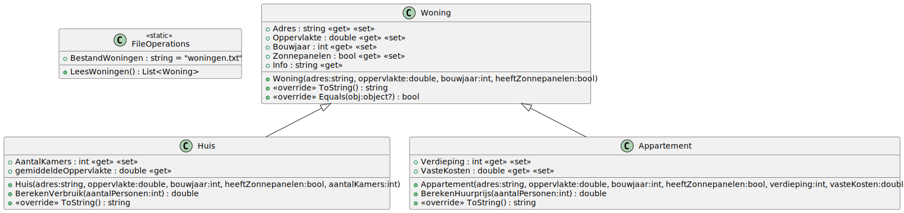

# 06_05

## Deel 1 - Klassen



### Woning


**Property `Info`**

Deze property is een samengestelde property die een tekstueel overzicht geeft. Een voorbeeld hiervan is `Appartement - 123 Urban Towers`.

Maak voor deze methode gebruik van `this.GetType().Name`.

**Methode `ToString`**

Deze methode geeft een ander tekstueel voorbeeld van de woning een voorbeeld hiervan is het volgende:

```plaintext
De woning gelegen te 123 Urban Towers heeft een oppervlakte van 150 vierkante meter en is gebouwd in 1995. Zonnepanelen zijn al aanwezig.
```

**Methode `Equals`**

Deze methode controleert of twee woningen hetzelfde zijn. Twee woningen zijn hetzelfde wanneer hun type en adres hetzelfde zijn.

### Huis


**Propery `GemiddeldeKameropervlakte`**

Deze proeprty is een readonly propery. Deze geeft de oppervlakte verdeeld over de verschillende kamers. (Oppervlakte/AantalKamers) 

**Methode `BerekenVerbruik`** 

Deze methode berekent het verbruik van de woning. Er word gewerkt met een startwaarde van 100 kWh. Hierbij wordt 100 kWh bijgeteld indien het bouwjaar voor 1970 ligt. Indien het er zonnepannelen aanwezig zijn, zal er 20 kWh minder verbruikt worden. Tenslotte wordt er nog per persoon 5 kWh bijgeteld.

**Methode `ToString`**

Deze methode geeft volgende tekstuele weergave van het huis:

```plaintext
De woning gelegen te 123 Main Street heeft een oppervlakte van 200 vierkante meter en is gebouwd in 1960. Zonnepanelen zijn al aanwezig.
Er zijn 4 kamers.
```

### Appartement


**Methode `BerekenHuurprijs`**

Deze methode berekent wat het zou kosten om met een aantal personen een appartement te huren. Men start vanuit de VasteKosten. Per verdieping stijgt de prijs met 50 euro en per persoon stijgt de prijs met 30 euro. 
Bijvoorbeeld: Een appartement heeft vaste kosten van 300 euro. Het appartement is gelegen op de 10de verdieping en er gaan 5 personen in wonen. De huurprijs is dan: 300 + (50 * 10) + (30 * 5) = 950 euro

**Methode `ToString`**

Deze methode geeft volgende tekstuele weergave van het appartement:

```plaintext
De woning gelegen te 123 Urban Towers heeft een oppervlakte van 150 vierkante meter en is gebouwd in 1995. Zonnepanelen zijn al aanwezig.
De vaste kosten voor dit appartement zijn 350 euro.
```

### VerbruikHelper


**Methode `BerekenVerbruikObvEPeil`**

Deze methode berekent het verbruik obv het e-peil dat meegegeven wordt. Het extra verbruik wordt berekend door het e-peil te vermenigvuldigen met 5 kWh. Dit extra verbruik wordt bij het originele verbruik opgeteld.

**Methode `BerekenVerbruikVoorEpcA`**

Deze methode berekent het verbruik voor een EPC A woning. Het verbruik wordt berekend door het het originele verbruik te verminderen met 10%. Je kan dit doen door het originele verbruik te vermenigvuldigen met 0.9.

### FileOperations


**Property `BestandWoningen`**
    
Dit property wordt ingesteld op `woningen.txt`. Dit is de naam van het bestand waarin de woningen zich bevinden.
    
**Methode `LeesWoningen`**
    
Deze methode leest alle woningen in die zich in het tekstbestand bevinden. Het tekstbestand bevat een mengeling van zowel huizen als appartementen. Returnwaarde is een lijst van alle woningen.
    
Een verduidelijking bij het bestand `woningen.txt`:

```plaintext
Huis;123 Main Street;200;1960;true;4
Appartement;Apt 101, 456 High Rise Lane;120;2000;true;10;300
Appartement;Apt 202, 789 City View Plaza;90;2015;false;5;250
Huis;456 Oak Avenue;150;2005;false;3
Appartement;Apt 303, 123 Urban Towers;150;1995;true;8;350
Huis;789 Pine Lane;180;1985;true;5
Huis;101 Maple Drive;220;2010;false;6
Appartement;Apt 404, 567 Metro Heights;110;2008;false;3;200
```
    
- Elke regel bevat volgende zaken, gescheiden door een punt-komma: `Type`;`Adres`;`Oppervlakte`;`Bouwjaar`;`HeeftZonnepanelen`
- Voor een appartement komen er nog twee velden bij: `Verdieping`;`VasteKosten`
- Voor een huis komt er nog één veld bij: `AantalKamers`

## Deel 2 - Console applicatie

### Werking

Bij het starten van de applicatie krijgt de gebruiker een overzicht van alle woningen te zien. Deze zijn genummerd.

De gebruiker kan nu een van de woningen kiezen aan de hand van de nummer. Daarna wordt er gevraagd met hoeveel personen je in deze woning woont.

Hierna krijgt de gebruiker drie keuzes: info over de woning geven, het verbruik berekenen of de huurprijs berekenen.

- Indien er gekozen wordt voor info over de woning, wordt de info van de woning getoond.
- Indien er gekozen wordt voor het verbruik berekenen, wordt vervolgens het EPC en het E-peil opgevraagd.
  - Indien het om een EPC 'A' woning gaat, wordt het verbruik voor een EPC 'A' woning berekend.
  - Indien het om een ander EPC gaat, wordt het verbruik berekend obv het E-peil.
  - Toon het verbruik aan de gebruiker.
- Indien er gekozen wordt voor de huurprijs berekenen
  - Toon de huurprijs aan de gebruiker.

Bekijk de voorbeelden voor de exacte werking.

### Voorbeelden


Een huis wordt gekozen. We vragen informatie hierover.

```plaintext
Overzicht van de woningen:
1. Huis - 123 Main Street
2. Appartement - Apt 101, 456 High Rise Lane
3. Appartement - Apt 202, 789 City View Plaza
4. Huis - 456 Oak Avenue
5. Appartement - Apt 303, 123 Urban Towers
6. Huis - 789 Pine Lane
7. Huis - 101 Maple Drive
8. Appartement - Apt 404, 567 Metro Heights
Welke woning wil je bekijken (1-8): 1

Met hoeveel personen woon je in deze woning?
Aantal personen (1-10): 5

1. Info over de woning
2. Info over het verbruik
3. Info over de huurprijs
Maak een keuze (1-3): 1

De woning gelegen te 123 Main Street heeft een oppervlakte van 200 vierkante meter en is gebouwd in 1960. Zonnepanelen zijn al aanwezig.
Er zijn 4 kamers.
```

Een huis wordt gekozen. We berekenen het verbruik.

```plaintext
...
Welke woning wil je bekijken (1-8): 1

Met hoeveel personen woon je in deze woning?
Aantal personen (1-10): 5

1. Info over de woning
2. Info over het verbruik
3. Info over de huurprijs
Maak een keuze (1-3): 2

1. A
2. B
3. C
4. D
5. E
6. F
Welk EPC heeft de woning? (1-6): 1

Geef het E-Peil van de woning (1-20): 10

Het verbruik van deze woning is 184,5 kWh.
```

Een huis wordt gekozen. We berekenen het verbruik van de woning.

```plaintext
...
Welke woning wil je bekijken (1-8): 1

Met hoeveel personen woon je in deze woning?
Aantal personen (1-10): 5

1. Info over de woning
2. Info over het verbruik
3. Info over de huurprijs
Maak een keuze (1-3): 2

1. A
2. B
3. C
4. D
5. E
6. F
Welk EPC heeft de woning? (1-6): 2

Geef het E-Peil van de woning (1-20): 10

Het verbruik van deze woning is 255 kWh.
```

Een appartement wordt gekozen. We vragen informatie hierover.

```plaintext
...
Welke woning wil je bekijken (1-8): 2

Met hoeveel personen woon je in deze woning?
Aantal personen (1-10): 5

1. Info over de woning
2. Info over het verbruik
3. Info over de huurprijs
Maak een keuze (1-3): 1

De woning gelegen te Apt 101, 456 High Rise Lane heeft een oppervlakte van 120 vierkante meter en is gebouwd in 2000. Zonnepanelen zijn al aanwezig.
De vaste kosten voor dit appartement zijn 300 euro.
```

Een appartement wordt gekozen. We berekenen de huurprijs van de woning.

```plaintext
...
Welke woning wil je bekijken (1-8): 2

Met hoeveel personen woon je in deze woning?
Aantal personen (1-10): 3

1. Info over de woning
2. Info over het verbruik
3. Info over de huurprijs
Maak een keuze (1-3): 3

De huurprijs van deze woning is 890 euro.
```