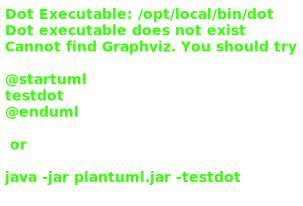

# 07_00

## Klassen

### Dier

- Abstracte property `IsZoogdier` is een read-only property
- Abstracte methode `Voeren()` geeft een tekstuele returnwaarde
- Abstracte methode `MaakGeluid()` geeft een tekstuele returnwaarde
- Niet-abstracte methode `Slaap()` geeft 'Zzz' als tekstuele returnwaarde

### Beer

- Property `IsZoogdier` geeft een positieve returnwaarde
- Methode `Voeren()` geeft 'RAWR!' als tekstuele returnwaarde
- Methode `MaakGeluid()` geeft 'GROM!' als tekstuele returnwaarde

### Kikker

- Property `IsZoogdier` geeft een negatieve returnwaarde
- Methode `Voeren()` geeft 'Ribbit!' als tekstuele returnwaarde
- Methode `MaakGeluid()` geeft 'Kwaak!' als tekstuele returnwaarde