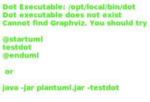

# 07_01

## Klassen

### Rekening

-Abstracte property `Rente` is een read-only property
-Abstracte methode `Afhalen(double bedrag)` geeft een ja/nee returnwaarde
-Abstracte methode `Storten(double bedrag)` geeft een ja/nee returnwaarde
-Niet-abstracte methode `SchrijfRenteBij()` maakt gebruik van rente om de rente bij het huidige bedrag op de rekening toe te voegen
-Niet-abstracte methode `IsGeldig()` controlleert de geldigheid van het iban van de rekening

### BelfiusRekening

-Property `Rente` geeft een returnwaarde van 5,5
-Methode `Afhalen(double bedrag)` zorgt voor een vermindering van het bedrag op de rekening. Dit kan enkel als de vermindering niet groter is dan 200
-Methode `Storten(double bedrag)` zorgt voor een verhoging van het bedrag op de rekening. Dit kan enkel als de vermindering niet groter is dan 100

### ArgentaRekening

-Property `Rente` geeft een returnwaarde van 4,5
-Methode `Afhalen(double bedrag)` zorgt voor een vermindering van het bedrag op de rekening. Dit kan enkel als de vermindering niet groter is dan 100
-Methode `Storten(double bedrag)` zorgt voor een verhoging van het bedrag op de rekening. Dit kan enkel als de vermindering niet groter is dan 200