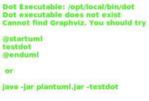

# 08_00

## Klassen

### Balk

- Methode `BepaalKleur()` geeft 'groen' als tekstuele returnwaarde
- Methode `BerekenOppervlakte()` geeft de oppervlakte van de balk terug Formule: Breedte x Hoogte

### Driehoek

- Methode `BepaalKleur()` geeft 'rood' als tekstuele returnwaarde
- Methode `BerekenOppervlakte()` geeft de oppervlakte van de driehoek terug Formule: (Breedte x Hoogte) / 2
