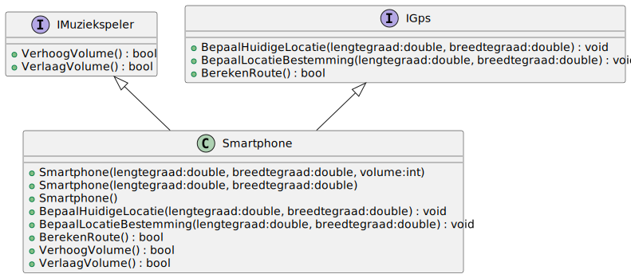

# 08_01

## Klassen

### Smartphone

- Constructors
    - De standaard waarde voor de lengte- en breedtegraad zijn 0
    - De standaard waarde voor het volume is 5
- Methode `VerhoogVolume()` verhoogt het volume met 1 indien het volume nog niet reeds 10 is. De returnwaarde zal true zijn indien het gelukt is het volume te verhogen. Anders wordt een false teruggegeven.
- Methode `VerlaagVolume()` verlaagt het volume met 1 indien het volume nog niet reeds 0 is. De returnwaarde zal true zijn indien het gelukt is het volume te verlagen. Anders wordt een false teruggegeven.
- Methode `BepaalHuidigeLocatie()` zal de waardes van `HuidigeLengtegraad` en `HuidigeBreedtegraad` aanpassen aan de hand van de meegegeven parameters
- Methode `BepaalLocatieBestemming()` zal de waardes van `LengtegraadBestemming` en `BreedtegraadBestemming` aanpassen aan de hand van de meegegeven parameters
- Methode `BerekenRoute()` zal een true of false teruggeven afhankelijk of alle 4 de benodigde graden ingevuld zijn
