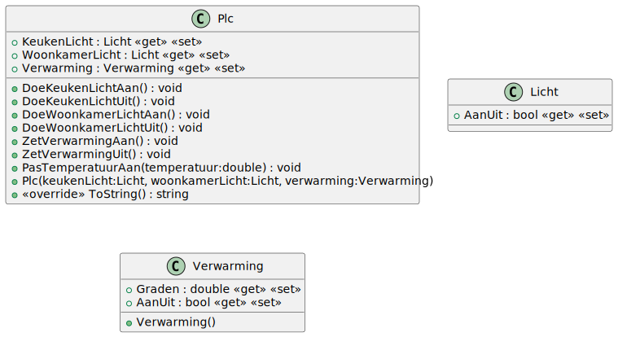
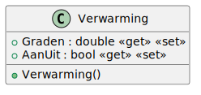
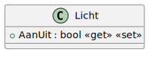
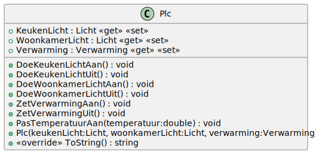

# 09_01

## Klassen



### Verwarming



**Constructor**

De standaardwaarde is 0 graden en uitgeschakeld.

### Licht



**Constructor**

De standaardwaarde is uitgeschakeld.

### Plc



**Property `Keukenlicht`**

Deze property bevat een instantie van de klasse `Licht` die de verlichting in de keuken regelt.

**Property `Woonkamerlicht`**

Deze property bevat een instantie van de klasse `Licht` die de verlichting in de woonkamer regelt.

**Property `Verwarming`**

Deze property bevat een instantie van de klasse `Verwarming` die de verwarming in de woonkamer regelt.

**Methodes `DoeXXXXLichtAan` en `DoeXXXXLichtUit`**

Deze methodes zetten het licht in de keuken of woonkamer aan of uit. Waarbij XXXX staat voor `Keuken` of `Woonkamer`.

**Methode `ZetVerwarmingAan` en `ZetVerwarmingUit`**

Deze methodes zetten de verwarming in de woonkamer aan of uit.

**Methode `PasTemperauurAan`**

Deze methode past de temperatuur van de verwarming aan naar de opgegeven waarde.

**Methode `ToString`**

Deze methode geeft een tekstuele weergave van de klasse `Plc`:

```plaintext
Keukenlicht: <Aan/Uit>
Woonkamerlicht: <Aan/Uit>
Verwarming: <Aan/Uit>
Temperatuur: <Temperatuur>
```

## Console applicatie

Bij het opstarten van de applicatie krijgt de gebruiker een menu met de volgende opties:

0. Keukenlicht
1. Woonkamerlicht
2. Verwarming
3. Afsluiten

Wanneer optie `Afsluiten` wordt gekozen, wordt de applicatie afgesloten.

Wanneer optie `Keukenlicht` of `Woonkamerlicht` wordt gekozen, krijgt de gebruiker de volgende opties:

0. Aan
1. Uit

Wanneer optie `Verwarming` wordt gekozen, krijgt de gebruiker de volgende opties:

0. Aan
1. Uit
2. Temperatuur aanpassen

Wanneer de optie `Aan` of `Uit` gekozen wordt, wordt de status van het licht of de verwarming aangepast. Wanneer de optie `Temperatuur aanpassen` wordt gekozen, wordt de gebruiker gevraagd om een temperatuur in te geven. Deze temperatuur wordt dan ingesteld.

Na elke keuze wordt de status van de `Plc` getoond. Blijf dit herhalen tot de gebruiker kiest om de applicatie af te sluiten.