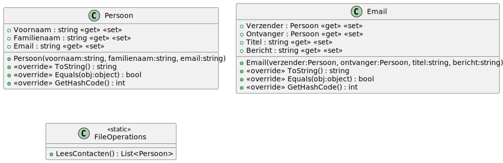

# 09_02

*Maak gebruik van het bestand `contacten.txt`.*

## Klassen

Werk minstens volgende klassen uit. Eventueel kan je nog extra klassen toevoegen of extra properties en methodes voorzien.

### Overzicht



### Email

**Methode `Equals` en `GetHashCode`**

Een email is gelijk aan een andere email als beide een van het type email zijn en dezelfde ontvanger, verzender, titel en bericht hebben.

## Console applicatie

Maak een applicatie waarmee de gebruiker een email kan versturen. Vraag eerst om voornaam, familienaam en emailadres in te lezen. Deze mogen niet leeg zijn. Daarna kan de gebruiker een ontvanger kiezen. De ontvangers worden ingelezen uit het bestand. Als laatste vraag je nog een titel en bericht. Hierna wordt de email verstuurd.

**Opgelet: twee personen zijn gelijk wanneer ze dezelfde email hebben.**

### Voorbeeld

```plaintext
Geef voornaam: John
Geef familienaam: Doe
Geef emailadres: johndoe@gmail.com
1. Ferrel Rings (frings0@state.tx.us)
2. Moyna Ewbank (mewbank1@sohu.com)
3. Melinda Wrefford (mwrefford2@globo.com)
4. Faunie Jordison (fjordison3@netscape.com)
5. Hedwig Bunker (hbunker4@storify.com)
6. Phyllys Blissett (pblissett5@microsoft.com)
7. Goldarina Houlton (ghoulton6@dyndns.org)
8. Obed Moughton (omoughton7@howstuffworks.com)
9. Sayre Tellenbroker (stellenbroker8@merriam-webster.com)
10. Angel Smalley (asmalley9@shop-pro.jp)
Kies ontvanger: 6
Geef titel: Aanwezigheid
Geef bericht: Ben je aanwezig op de vergadering?

Volgende email wordt verstuurd:
Verzender: John Doe (johndoe@gmail.com)
Ontvanger: Phyllys Blissett (pblissett5@microsoft.com)
Titel: Aanwezigheid
Bericht: Ben je aanwezig op de vergadering?
```