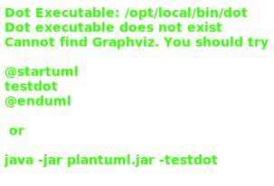
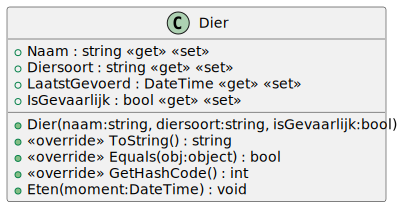
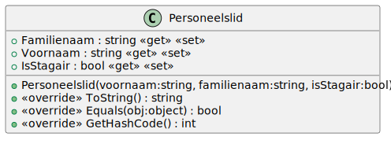
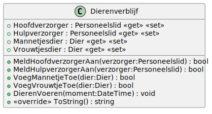

# 09_03

## Klassen

### Overzicht



### Dier



**Methode `ToString`**

Deze methode retourneert een tekstuele weergave van het object: `<Naam> (<Diersoort>)`

**Methode `Equals` en `GetHashCode`**

Deze methodes controleren of twee objecten hetzelfde zijn. Twee objecten zijn hetzelfde als ze dezelfde naam en diersoort hebben.

**Methode `Eten`**

Deze methode zorgt er voor dat het dier gevoerd wordt. De LaatstGevoerd waarde wordt aangepast naar het moment van voeren.

### Personeelslid



**Methode `ToString`**

Deze methode retourneert een tekstuele weergave van het object: `<Voornaam> <Naam> (<Functie>)`. Hierbij is `<Functie>` de functie "Stagair" of "Vaste medewerker" obv de bijhorende property.

**Methodes `Equals` en `GetHashCode`**

Deze methode controleert of twee objecten hetzelfde zijn. Twee objecten zijn hetzelfde als ze dezelfde voornaam en naam hebben.

### Dierenverblijf



**Methode `MeldHoofdverzorgerAan`**

Deze methode kent de hoofdverzorger toe aan het verblijf. Een hoofdverzorger kan enkel toegekend worden als er minstens 1 dier aanwezig is in het verblijf. Daarnaast mag een stagair nooit worden toegekend aan een dierenverblijf waar een gevaarlijk dier verblijft. Returnwaarde van deze methode is `true` als de hoofdverzorger werd toegekend, `false` indien dit niet het geval is (om wille van de voorwaarden).

**Methode `MeldHulpverzorgerAan`**

Deze methode kent de hulpverzorger toe aan het verblijf. Een hulpverzorger kan enkel toegekend worden als er minstens 1 dier aanwezig is in het verblijf. Returnwaarde van deze methode is `true` als de hulpverzorger werd toegekend, `false` indien dit niet het geval is (om wille van de voorwaarden).

**Methode `VoegMannetjeToe`**

Deze methode kent het mannetje toe aan het verblijf. Een mannetje kan enkel worden toegevoegd als er nog geen vrouwtje aanwezig is OF als het aanwezige vrouwtje van dezelfde soort is. Returnwaarde van deze methode is `true` als het mannetje werd toegekend, `false` indien dit niet het geval is (om wille van de voorwaarden).

**Methode `VoegVrouwtjeToe`**

Deze methode kent het vrouwtje toe aan het verblijf. Een vrouwtje kan enkel worden toegevoegd als er nog geen mannetje aanwezig is OF als het aanwezige mannetje van dezelfde soort is. Returnwaarde van deze methode is `true` als het vrouwtje werd toegekend, `false` indien dit niet het geval is (om wille van de voorwaarden).

**Methode `DierenVoeren`**

Alle dieren in het verblijf worden gevoerd. Gebruik hiervoor de methode van de dieren.

**Methode `ToString`**

Deze methode geeft een tekstuele weergave van het dierenverblijf:

```plaintext
Verzorgers
==========
Hoofdverzorger: Claes Jan (Vaste medewerker)
Hulpverzorger: D'hondt Nelly (Stagair)

Dieren
======
Mannetjesdier: Clyde (Gele pijlgifkikker) (Laatst gevoerd: 18:00)
Vrouwtjesdier: Bonnie (Gele pijlgifkikker) (Laatst gevoerd: 18:00)
```

Maak voor de tijd gebruik van ToShortTimeString. De testen worden automatisch aangepast naar de juiste tijdszone van de machine.

## Console applicatie

Werk een console applicatie uit die het mogelijk maakt om uit een lijst van dieren 2 dieren toe te voegen aan een dierenverblijf. Daarna worden er twee verzorgers gekoppeld aan het verblijf. één hoofdverzorger en één hulpverzorger. Als dit gebeurd is, worden beide dieren gevoerd en wordt er een overzicht getoond van het verblijf. Zorg voor voldoende validaties en controles waar nodig. Hou rekening met de controles in de klassen.

### Voorbeeld

```plaintext
0. Fonske (Keizerpenguin)
1. Annie (Keizerpenguin)
2. Bertje (West-Afrikaanse dwerggeit)
3. Marie (West-Afrikaanse dwerggeit) 
4. Bonnie (Gele pijlgifkikker)       
5. Clyde (Gele pijlgifkikker)        
6. Sonja (Rosszeehond)
7. Gerrie (Rosszeehond)
8. Inie (Antennebaarsje)
9. Minie (Antennebaarsje)

Welk mannetjesdier wil je toevoegen? 0

0. Fonske (Keizerpenguin)
1. Annie (Keizerpenguin)
2. Bertje (West-Afrikaanse dwerggeit)
3. Marie (West-Afrikaanse dwerggeit) 
4. Bonnie (Gele pijlgifkikker)
5. Clyde (Gele pijlgifkikker)
6. Sonja (Rosszeehond)
7. Gerrie (Rosszeehond)
8. Inie (Antennebaarsje)
9. Minie (Antennebaarsje)

Welk vrouwtjesdier wil je toevoegen? 1

0. Claes Jan (Vaste medewerker)
1. Peeters John (Vaste medewerker)
2. Debol An (Vaste medewerker)
3. Dehouwer Vince (Vaste medewerker)
4. Devis Carina (Vaste medewerker)
5. D'hondt Nelly (Stagair)
6. Vreys Cindy (Stagair)

Welk personeelslid wil je aanmelden als hoofdverzorger? 2

0. Claes Jan (Vaste medewerker)
1. Peeters John (Vaste medewerker)
2. Debol An (Vaste medewerker)
3. Dehouwer Vince (Vaste medewerker)
4. Devis Carina (Vaste medewerker)
5. D'hondt Nelly (Stagair)
6. Vreys Cindy (Stagair)

Welk personeelslid wil je aanmelden als hulpverzorger? 5

Om hoelaat wil je de dieren voeren (hh)? 18

De dieren worden gevoerd!

Verzorgers
==========
Hoofdverzorger: Debol An (Vaste medewerker)
Hulpverzorger: D'hondt Nelly (Stagair)

Dieren
======
Mannetjesdier: Fonske (Keizerpenguin) (Laatst gevoerd: 18:00)
Vrouwtjesdier: Annie (Keizerpenguin) (Laatst gevoerd: 18:00)
```
