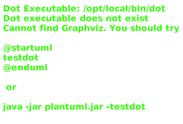
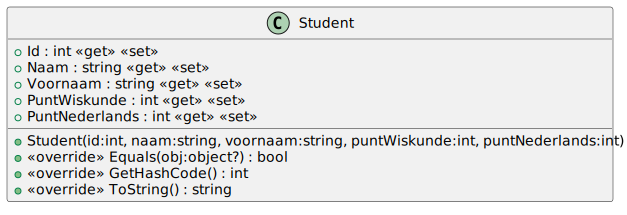
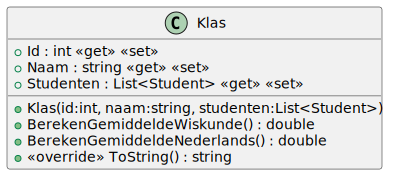

# 10_00

## Klassen

### Overzicht



### Student



**Methode `ToString`**

Deze methode retourneert een tekstuele weergave van het object: `<ID> -  <Voornaam> <Naam> - Punt wiskunde: <PuntWiskunde> - Punt nederlands: <PuntNederlands>`

**Methode `Equals` en `GetHashCode`**

Een student is gelijk aan een andere student als beide een van het type student zijn, hetzelfde ID hebben en dezelfde achternaam hebben.

### Klas



**Methode `BerekenGemiddeldeWiskunde`**

Deze methode berekent het gemiddelde van de punten wiskunde van de studenten in de klas.

**Methode `BerekenGemiddeldeNederlands`**

Deze methode berekent het gemiddelde van de punten nederlands van de studenten in de klas.

**Methode `ToString`**

Deze methode retourneert een tekstuele weergave van het object: 
```
Klas <ID> - <Naam>
<LijstVanAlleStudenten>
```

bijvoorbeeld:
```plaintext
Klas 1 - 1A
1 - Jan Janssens - Punt wiskunde: 90 - Punt nederlands: 60
2 - Piet Pieters - Punt wiskunde: 80 - Punt nederlands: 70
3 - Joris Jorissen - Punt wiskunde: 70 - Punt nederlands: 80
...
```

### FileOperations

**Methode `LeesStudenten`**

Deze methode leest de gegevens van de studenten uit het bestand en retourneert een lijst van studenten. De methode accepteert een parameter `bestandsnaam` met de naam van het bestand.

## Console applicatie

*Maak gebruik van de bestanden `studenten-1.txt`, `studenten-2.txt`, `studenten-3.txt`, `studenten-4.txt` en `studenten-5.txt`.*

Begin met het vragen van een bestandsnaam. De studenten in dit bestand worden ingelezen.

Laat de gebruiker nu de keuze maken uit volgende opties:

1. Klasoverzicht tonen
2. Gemiddeldes tonen voor de klas

De applicatie sluit hierna af.

### Voorbeeld:

```plaintext
Geef de naam van het bestand: studenten-1.txt
Wat wil je doen?
1. Overzicht van de studenten tonen
2. Gemiddeldes tonen
Geef je keuze: 1
Klas 1 - 1A
1 - De Vries Jan - Punt wiskunde: 75 - Punt nederlands: 80    
2 - Jansen Anna - Punt wiskunde: 60 - Punt nederlands: 70     
3 - Pietersen Peter - Punt wiskunde: 85 - Punt nederlands: 90 
4 - Bakker Sara - Punt wiskunde: 70 - Punt nederlands: 75     
5 - Klein Johan - Punt wiskunde: 65 - Punt nederlands: 80     
6 - Willems Lotte - Punt wiskunde: 78 - Punt nederlands: 88   
7 - Maes Lucas - Punt wiskunde: 92 - Punt nederlands: 85      
8 - Claes Emma - Punt wiskunde: 88 - Punt nederlands: 92      
9 - Vermeulen Thomas - Punt wiskunde: 75 - Punt nederlands: 78
10 - Lambrechts Eva - Punt wiskunde: 80 - Punt nederlands: 85
11 - Martens Tim - Punt wiskunde: 68 - Punt nederlands: 70
12 - Peeters Lara - Punt wiskunde: 90 - Punt nederlands: 95
13 - Brouwers Ruben - Punt wiskunde: 82 - Punt nederlands: 88
14 - Vandenberg Sophie - Punt wiskunde: 77 - Punt nederlands: 80
15 - Hendriks Mia - Punt wiskunde: 65 - Punt nederlands: 72
16 - Wouters Michiel - Punt wiskunde: 95 - Punt nederlands: 90
17 - Verschueren Amber - Punt wiskunde: 85 - Punt nederlands: 88
18 - Smit Daan - Punt wiskunde: 73 - Punt nederlands: 75
19 - Jacobs Femke - Punt wiskunde: 78 - Punt nederlands: 80
20 - Bos Niels - Punt wiskunde: 60 - Punt nederlands: 65
21 - De Bruin Lise - Punt wiskunde: 89 - Punt nederlands: 94
22 - Kusters Stijn - Punt wiskunde: 72 - Punt nederlands: 78
23 - De Boer Lisa - Punt wiskunde: 80 - Punt nederlands: 85
24 - Kok Bram - Punt wiskunde: 68 - Punt nederlands: 72
25 - Bosman Sofie - Punt wiskunde: 88 - Punt nederlands: 90
```

```plaintext
Geef de naam van het bestand: studenten-2.txt
Wat wil je doen?
1. Overzicht van de studenten tonen
2. Gemiddeldes tonen
Geef je keuze: 2
Gemiddelde wiskunde: 78,56  
Gemiddelde Nederlands: 80,72
```