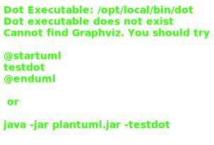
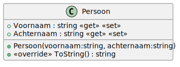
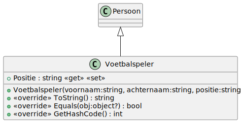

# 10_01

## Klassen

### Overzicht



### Persoon



**Methode `ToString`**

Deze methode retourneert een tekstuele weergave van het object: `<Naam> - <Voornaam>`

### Trainer


**Methode `ToString`**

Deze methode retourneert een tekstuele weergave van het object: `<Naam> - <Voornaam> verdient <Salaris> euro`

### Voetbalspeler



**Methode `ToString`**

Deze methode retourneert een tekstuele weergave van het object: `<Naam> - <Voornaam> speelt op positie <Positie>`

**Methode `Equals` en `GetHashCode`**

Een voetbalspeler is gelijk aan een andere voetbalspeler als beide een van het type voetbalspeler zijn, dezelde voornaam en achternaam hebben en op dezelfde positie spelen.

### Team

**Methode `VoegSpelerToe`**

Deze methode voegt een speler toe aan het team als de speler nog niet in het team zit.

**Methode `ToString`**

Deze methode geeft een tekstuele weergave van het team:

```plaintext
Trainer: <Trainer>
Aantal spelers: <AantalSpelers>
Aantal spelers: <AantalSpelers>
Aantal verdedigers: <AantalVerdedigers>
Aantal aanvallers: <AantalAanvallers>
Aantal middenvelders: <AantalMiddenvelders>
Aantal keepers: <AantalKeepers>
```

### FileOperations

**Property `BestandPersonen`**

Deze property bevat de naam van het bestand waarin de personen worden opgeslagen.

**Methode `LeesPersonen`**

Deze methode leest de personen uit het bestand en retourneert een lijst van personen. In deze lijst zitten zowel trainers als voetbalspelers.

**Methode `LeesTrainers`**

Werk hiervoor eerst de methode `LeesPersonen` uit en gebruik deze. Deze methode retourneert een lijst van trainers. Filter hiervoor de output van `LeesPersonen`.

**Methode `LeesSpelers`**

Werk hiervoor eerst de methode `LeesPersonen` uit en gebruik deze. Deze methode retourneert een lijst van voetbalspelers. Filter hiervoor de output van `LeesPersonen`.

## Console applicatie

*Maak gebruik van het bestand `voetbal.txt`.*

Alle spelers en trainers worden ingelezen vanuit het bestand `voetbal.txt`. 

De gebruiker krijgt een overzicht van alle trainers en kan er hier een uit kiezen voor zijn team. Daarna kan de gebruiker 11 spelers kiezen. Wanneer er 11 spelers gekozen zijn, wordt een overzicht van het team getoond.

### Voorbeeld

```plaintext
1. Pep Guardiola verdient 12000000 euro
2. Jurgen Klopp verdient 10000000 euro
3. Zinedine Zidane verdient 8000000 euro       
4. Carlo Ancelotti verdient 9000000 euro       
5. Diego Simeone verdient 11000000 euro        
6. Thomas Tuchel verdient 9500000 euro
7. Mauricio Pochettino verdient 8500000 euro   
8. Ole Gunnar Solskjær verdient 9000000 euro   
9. Julian Nagelsmann verdient 9200000 euro     
10. Massimiliano Allegri verdient 10000000 euro
11. Ronald Koeman verdient 8500000 euro        
12. Erik Ten Hag verdient 9000000 euro
13. Brendan Rodgers verdient 8000000 euro      
14. Ralph Hasenhüttl verdient 7500000 euro     
15. Marcelo Bielsa verdient 8500000 euro       
16. Graham Potter verdient 7000000 euro        
17. Nuno Espirito Santo verdient 7500000 euro  
18. Steve Bruce verdient 6000000 euro
19. Roy Hodgson verdient 6500000 euro
20. Sam Allardyce verdient 7000000 euro     

Kies een trainer: 3

1. Lionel Messi speelt op positie Aanvaller
2. Cristiano Ronaldo speelt op positie Aanvaller     
3. Neymar da Silva Júnior speelt op positie Aanvaller
4. Kylian Mbappé speelt op positie Aanvaller
5. Mohamed Salah speelt op positie Aanvaller
6. Robert Lewandowski speelt op positie Aanvaller    
7. Kevin De Bruyne speelt op positie Middenvelder    
8. Luka Modric speelt op positie Middenvelder        
9. N'Golo Kanté speelt op positie Middenvelder       
10. Bruno Fernandes speelt op positie Middenvelder
11. Sergio Ramos speelt op positie Verdediger
12. Virgil van Dijk speelt op positie Verdediger
13. Ruben Dias speelt op positie Verdediger
14. Andrew Robertson speelt op positie Verdediger
15. Alisson Becker speelt op positie Keeper
16. Jan Oblak speelt op positie Keeper
17. Thibaut Courtois speelt op positie Keeper
18. Ederson Moraes speelt op positie Keeper
19. Harry Kane speelt op positie Aanvaller
20. Erling Haaland speelt op positie Aanvaller
21. Antoine Griezmann speelt op positie Aanvaller
22. Raheem Sterling speelt op positie Aanvaller
23. Joshua Kimmich speelt op positie Middenvelder
24. Gareth Bale speelt op positie Aanvaller
25. Sadio Mané speelt op positie Aanvaller
26. Paul Pogba speelt op positie Middenvelder
27. Thomas Müller speelt op positie Aanvaller
28. Thiago Silva speelt op positie Verdediger
29. Henrique Casemiro speelt op positie Middenvelder
30. Jadon Sancho speelt op positie Aanvaller
31. Phil Foden speelt op positie Middenvelder
32. Vinícius Júnior speelt op positie Aanvaller
33. Jose Marquinhos speelt op positie Verdediger
34. Romelu Lukaku speelt op positie Aanvaller
35. Hakim Ziyech speelt op positie Middenvelder
36. Kalidou Koulibaly speelt op positie Verdediger
37. Jordan Henderson speelt op positie Middenvelder
38. Aymeric Laporte speelt op positie Verdediger
39. Leroy Sané speelt op positie Aanvaller
40. More Jorginho speelt op positie Middenvelder
41. Trent Alexander-Arnold speelt op positie Verdediger
42. Marcus Rashford speelt op positie Aanvaller
43. Frenkie de Jong speelt op positie Middenvelder
44. Henk Rodri speelt op positie Middenvelder
45. Matthijs de Ligt speelt op positie Verdediger
46. João Cancelo speelt op positie Verdediger
47. Jack Grealish speelt op positie Middenvelder
48. David Alaba speelt op positie Verdediger
49. Bernardo Silva speelt op positie Middenvelder
50. Leon Goretzka speelt op positie Middenvelder

Kies een speler: 1
Kies een speler: 2
Kies een speler: 3
Kies een speler: 4
Kies een speler: 5
Kies een speler: 6
Kies een speler: 7
Kies een speler: 8
Kies een speler: 9
Kies een speler: 10
Kies een speler: 11

Trainer: Zinedine Zidane verdient 8000000 euro
Aantal spelers: 11
Aantal verdedigers: 1
Aantal aanvallers: 6
Aantal middenvelders: 4
Aantal keepers: 0
```