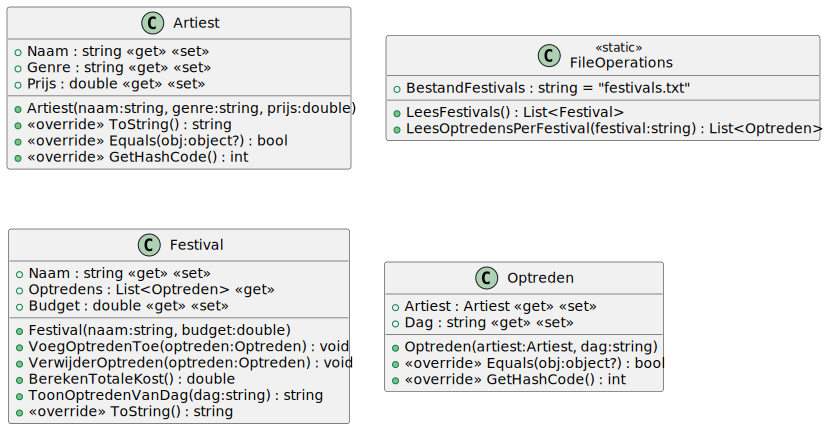
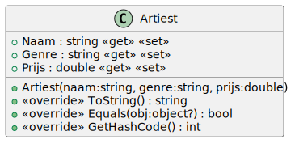
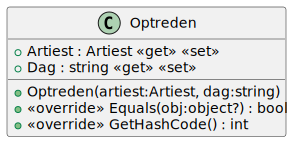
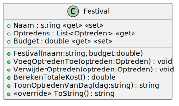

# 10_02

## Klassen

### Overzicht



### Artiest



**Methode `ToString`**

Deze methode retourneert een tekstuele weergave van het object: `<Naam> - (<Genre>)`

**Methode `Equals` en `GetHashCode`**

Een artiest is gelijk aan een andere artiest als beide een van het type artiest zijn en dezelfde naam hebben.

### Optreden



**Methode `Equals` en `GetHashCode`**

Een optreden is gelijk aan een ander optreden als beide een van het type optreden zijn, dezelfde artiest hebben en op dezelfde dag doorgaan.

### Festival



**Property `Optredens`**

Deze property bevat een lijst van optredens en is enkel leesbaar.

**Methode `VoegOptredenToe`**

Deze methode voegt een optreden toe aan het festival als het optreden nog niet in het festival zit en er niet over het budget gegaan word met het nieuwe optreden. De methode accepteert één parameter van het type `Optreden`. Dit is het optreden dat toegevoegd moet worden.

**Methode `VerwijderOptreden`**

Deze methode verwijdert een optreden van het festival. De methode accepteert één parameter van het type `Optreden`. Dit is het optreden dat verwijderd moet worden.

**Methode `BerekenTotaleKost`**

Deze methode berekent de totale kost van het festival over alle dagen.

**Methode `ToonOptredenVanDag`**

Deze methode toont een overzicht van optredens van een bepaalde dag van het festival. De methode accepteert één parameter `dag`. Dit is de dag waarvan de optredens getoond moeten worden.

Het overzicht ziet er als volgt uit:

```plaintext
Op <dag> komen volgende artiesten:
<Artiest1>
<Artiest2>
...
```

**Methode `ToString`**
Deze methode geeft een tekstuele weergave van het festival:

```plaintext
OVERZICHT FESTIVAL <NAAM FESTIVAL>
----------------------------
Op vrijdag komen volgende artiesten:
<naam artiest> (<genre artiest>)
Op zaterdag komen volgende artiesten:
<naam artiest> (<genre artiest>)
Op zondag komen volgende artiesten:
<naam artiest> (<genre artiest>)
In totaal werd er <totalekost> euro besteed aan artiesten.
Het budget bedraagt <budget> euro.
```

### FileOperations

**Property `BestandFestivals`**

Deze property bevat de naam van het bestand waarin de festivals worden opgeslagen.

**Methode `LeesFestivals`**

Deze methode leest de festivals uit het bestand en retourneert een lijst van festivals.

**Methode `LeesOptredensPerFestival`**

Deze methode leest de optredens per festival uit het bestand en retourneert een lijst van optredens per festival.

## Console applicatie

*Maak gebruik van het bestand `festivals.txt`, `pukkelpop.txt` en `groezrock.txt`.*

Alle festivals en optredens worden ingelezen vanuit het bestand `festivals.txt`.

De respectievelijke optredens van de festivals `Pukkelpop` en `Groezrock` worden ingelezen vanuit de bestanden `pukkelpop.txt` en `groezrock.txt`.

De gebruiker krijgt een overzicht van de festivals en kan een keuze maken. Daarna kan de gebruiker kiezen welke actie deze wil nemen met het gezoken festival.

Bij het tonen van het overzicht:

```plaintext
1. pukkelpop
2. groezrock

Welk festival kiest u? 1

1. Toon overzicht
2. Voeg optreden toe
3. Verwijder optreden

Wat wil u doen? 1

OVERZICHT FESTIVAL PUKKELPOP
----------------------------
Op vrijdag komen volgende artiesten:
Paramore (poprock)
Billie Eilish (electropop)
Op zaterdag komen volgende artiesten:
Chvrches (alternatief)
PRIZM (80's dance)
Op zondag komen volgende artiesten:
Silverstein (indie rock)
ITZY (kpop)
In totaal werd er 125000 euro besteed aan artiesten.
Het budget bedraagt 1000000 euro.
```

Bij het toevoegen van een optreden:

```plaintext
1. pukkelpop
2. groezrock

Welk festival kiest u? 1

1. Toon overzicht
2. Voeg optreden toe
3. Verwijder optreden

Wat wil u doen? 2

Op welke dag is het optreden? vrijdag
Welke artiest zal optreden? Taylor swift
Welk genre speelt deze artiest? pop
Hoeveel kost dit optreden? 50000

OVERZICHT FESTIVAL PUKKELPOP
----------------------------
Op vrijdag komen volgende artiesten:
Paramore (poprock)
Billie Eilish (electropop)
Taylor swift (pop)
Op zaterdag komen volgende artiesten:
Chvrches (alternatief)
PRIZM (80's dance)
Op zondag komen volgende artiesten:
Silverstein (indie rock)
ITZY (kpop)
In totaal werd er 175000 euro besteed aan artiesten.
Het budget bedraagt 1000000 euro.
```

Bij het verwijderen van een optreden:

```plaintext
1. pukkelpop
2. groezrock

Welk festival kiest u? 1

1. Toon overzicht
2. Voeg optreden toe
3. Verwijder optreden

Wat wil u doen? 3

Op welke dag is het optreden? vrijdag
Welke artiest zal optreden? Paramore

OVERZICHT FESTIVAL PUKKELPOP
----------------------------
Op vrijdag komen volgende artiesten:
Billie Eilish (electropop)
Op zaterdag komen volgende artiesten:
Chvrches (alternatief)
PRIZM (80's dance)
Op zondag komen volgende artiesten:
Silverstein (indie rock)
ITZY (kpop)
In totaal werd er 100000 euro besteed aan artiesten.
Het budget bedraagt 1000000 euro.
```