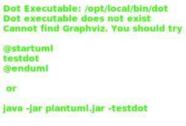
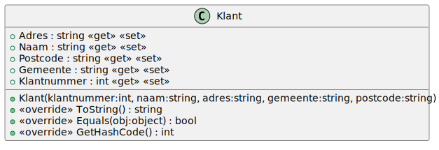
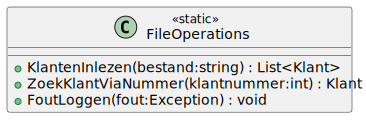

# 12_01

## Klassen

### Overzicht



### KlantNietGevondenException


**Constructor**

Geeft een tekstuele voorstelling van de Exception als volgt: `Klant met nummer <Klantnummer> bestaat niet.`. Maak hiervoor gebruik van constructor chaining.

### OngeldigBtwNummerException


**Constructor**

Geeft een tekstuele voorstelling van de Exception als volgt: `Het BTW-nummer moet beginnen met BE.`. Maak hiervoor gebruik van constructor chaining.

### Klant



**Methode `ToString`**

Deze methode geeft een tekstuele voorstelling van het object als volgt:

```plaintext
<Klantnummer>
<Naam>
<Adres>
<Postcode> <Gemeente>
```

**Methode `Equals` en `GetHashCode`**

Deze methode vergelijkt twee objecten van de klasse `Klant` met elkaar. De objecten zijn gelijk als de klantnummers gelijk zijn.

### ZakelijkeKlant


**Property `BtwNummer`**

Deze property bevat het BTW-nummer van de zakelijke klant. Dit gooit een `OngeldigBtwNummerException` wanneer het BTW-nummer niet begint met `BE`.

### FileOperations



**Methode `KlantenInlezen`**

Lees alle klanten uit het txt-bestand. Fouten die zich voordoen worden gelogd via de `FoutLoggen` methode.

**Methode `ZoekKlantViaNummer`**

Zoek een klant via het klantnummer. Gooi een `KlantNietGevondenException` wanneer de klant niet gevonden wordt.

**Methode `FoutLoggen`**

Log een foutmelding naar een txt-bestand. Volgende zaken van de exception worden weggeschreven: type, message en stacktrace.

## Console applicatie

Bij het opstarten van de applicatie krijgt de gebruiker een menu met de volgende opties:

```plaintext
0. Alle klanten
1. Klant zoeken
```

Bij het selecteren van `Alle klanten`, zullen alle klanten op het scherm getoond worden. Bij het selecteren van `Klant zoeken`, zal een nummer gevraagd worden aan de gebruiker. Vervolgens wordt deze klant dan getoond.

Indien de klant niet wordt gevonden, wordt een `KlantNietGevondenException` gegooid. Deze exception wordt opgevangen en de message wordt getoond aan de gebruiker.