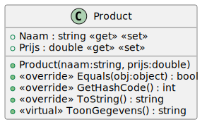
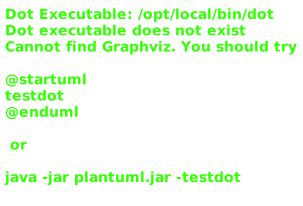
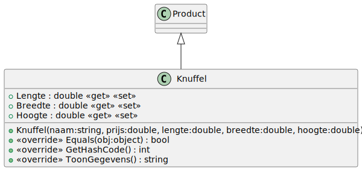
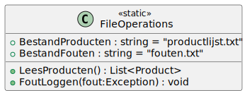
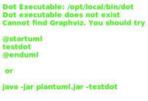
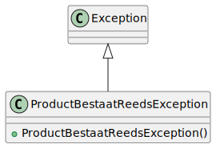

# 12_02

Voor deze oefening heb je volgend bestand nodig:
- productlijst.txt



## Klasse Product
**Property `Naam`**

Getter: Geeft de naam van het product terug.
Setter: Controleert of de opgegeven naam niet leeg of null is. Als dit het geval is, wordt een LegeTekstueleWaardeException gegenereerd.

**Property `Prijs`**

Getter: Geeft de prijs van het product terug.
Setter: Controleert of de opgegeven prijs niet negatief is. Als dit het geval is, wordt een NumeriekeWaardeOnderNulException gegenereerd.

**Constructor `Product(string naam, double prijs)`**

Initialiseert een nieuw product met opgegeven naam en prijs. Roep de setters van Naam en Prijs aan om de opgegeven waarden te valideren.

**Methode `Equals`**

Vergelijkt twee producten op basis van hun naam en het type van het object. Geeft true terug als ze gelijk zijn, anders false.

**Methode `GetHashCode`**

Genereert een hashcode op basis van de naam en het type van het product.

**Methode `ToString`**

Geeft een tekstuele voorstelling van het product in de vorm van "`TypeNaam` `Naam` (`Prijs`)".

**Methode `ToonGegevens`**

Geeft een meer uitgebreide tekstuele voorstelling van de productgegevens, inclusief naam en prijs.



## Klasse Stripboek
**Property `Auteur`**

Getter: Geeft de auteur van het stripboek terug.
Setter: Controleert of de opgegeven auteur niet leeg of null is. Als dit het geval is, wordt een LegeTekstueleWaardeException gegenereerd.

**Property `AantalPaginas`**

Getter: Geeft het aantal pagina's van het stripboek terug.
Setter: Controleert of het opgegeven aantal pagina's niet negatief is. Als dit het geval is, wordt een NumeriekeWaardeOnderNulException gegenereerd.

**Constructor `Stripboek(string naam, double prijs, string auteur, int aantalPaginas)`**

Initialiseert een nieuw stripboek met de opgegeven naam, prijs, auteur en aantal pagina's. Roep de constructor van de basisklasse Product aan om de naam en prijs te initialiseren.

**Methode `Equals`**

Vergelijkt twee stripboeken op basis van de eigenschappen van zowel het product als het stripboek zelf. Geeft true terug als ze gelijk zijn, anders false.

**Methode `GetHashCode`**

Genereert een hashcode op basis van de eigenschappen van zowel het product als het stripboek zelf.

**Methode `ToonGegevens`**

Geeft een meer uitgebreide tekstuele voorstelling van de stripboekgegevens, inclusief naam, prijs, auteur en aantal pagina's. Roep de ToonGegevens-methode van de basisklasse aan om de gemeenschappelijke gegevens weer te geven.



## Klasse Knuffel
**Property `Lengte`**

Getter: Geeft de lengte van de knuffel terug.
Setter: Controleert of de opgegeven lengte niet negatief is. Als dit het geval is, wordt een NumeriekeWaardeOnderNulException gegenereerd.

**Property `Breedte`**

Getter: Geeft de breedte van de knuffel terug.
Setter: Controleert of de opgegeven breedte niet negatief is. Als dit het geval is, wordt een NumeriekeWaardeOnderNulException gegenereerd.

**Property `Hoogte`**

Getter: Geeft de hoogte van de knuffel terug.
Setter: Controleert of de opgegeven hoogte niet negatief is. Als dit het geval is, wordt een NumeriekeWaardeOnderNulException gegenereerd.

**Constructor `Knuffel(string naam, double prijs, double lengte, double breedte, double hoogte)`**

Initialiseert een nieuwe knuffel met de opgegeven naam, prijs, lengte, breedte en hoogte. Roep de constructor van de basisklasse Product aan om de naam en prijs te initialiseren.

**Methode `Equals`**

Vergelijkt twee knuffels op basis van de eigenschappen van zowel het product als de knuffel zelf. Geeft true terug als ze gelijk zijn, anders false.

**Methode `GetHashCode`**

Genereert een hashcode op basis van de eigenschappen van zowel het product als de knuffel zelf.

**Methode `ToonGegevens`**

Geeft een meer uitgebreide tekstuele voorstelling van de knuffelgegevens, inclusief naam, prijs en afmetingen. Roep de ToonGegevens-methode van de basisklasse aan om de gemeenschappelijke gegevens weer te geven.



## Klasse FileOperations

**Static property `BestandProducten`**

Pad naar het bestand waarin productgegevens worden opgeslagen (producten.txt).

**Static property `BestandFouten`**

Pad naar het bestand waarin fouten worden gelogd (fouten.txt).

**Static methode `LeesProducten`**

Leest productgegevens uit het bestand BestandProducten en retourneert een lijst van producten.
Gebruikt een StreamReader om het bestand regel voor regel te lezen.
Maakt dynamisch de juiste subclass (ofwel Stripboek of Knuffel) op basis van het type in het bestand.

**Static methode `FoutLoggen`**

Logt een uitzondering (Exception) naar het bestand foutenbestand.txt.
Gebruikt een StreamWriter om de foutinformatie (type, bericht en stacktrace) naar het bestand te schrijven.



## Klasse LegeTekstueleWaardeException
**Constructor `LegeTekstueleWaardeException(string attribuut)`**

Initialiseert een nieuwe uitzondering met de opgegeven attribuutnaam.
Het bericht van de uitzondering wordt dynamisch gegenereerd om aan te geven welke tekstuele waarde niet leeg mag zijn.


## Klasse NumeriekeWaardeOnderNulException
**Constructor `NumeriekeWaardeOnderNulException(string attribuut)`**

Initialiseert een nieuwe uitzondering met de opgegeven attribuutnaam.
Het bericht van de uitzondering wordt dynamisch gegenereerd om aan te geven welk attribuut onder nul mag zijn.



## Klasse ProductBestaatReedsException
**Constructor `ProductBestaatReedsException()`**

Initialiseert een nieuwe uitzondering met het bericht "Product bestaat reeds!".

## Console applicatie
Begin met het inlezen van alle producten. De gebruiker krijgt hierna een menu te zien met de volgende opties:

```plaintext
1. Stripboek toevoegen
2. Knuffel toevoegen
3. Producten tonen
4. Afsluiten
```

Bij het selecteren van Stripboek toevoegen of Knuffel toevoegen zal de gebruiker de nodige gegevens moeten ingeven. Het nieuwe product wordt toegevoegd aan de lijst van producten. Indien het product reeds bestaat, wordt een ProductBestaatReedsException gegooid. Deze exception wordt opgevangen en de message wordt getoond aan de gebruiker. Zolang de gebruiker niet voor optie 4 kiest, blijft de applicatie herhalen.
```plaintext
1. Stripboek toevoegen
2. Knuffel toevoegen
3. Producten tonen
4. Afsluiten
Geef uw keuze: 3
1. Stripboek Asterix en de Goths (1299)
2. Stripboek Kuifje in het Land van de Sovjets (999)
3. Stripboek Suske en Wiske - De Rode Ridder (1499)
4. Stripboek Donald Duck - De beste verhalen (899)
5. Stripboek Batman - The Killing Joke (1999)
6. Stripboek Spider-Man - Kraven's Last Hunt (2499)
7. Stripboek Maus (1699)
8. Stripboek Calvin and Hobbes - The Essential Collection (2999)
9. Stripboek Lucky Luke - De Daltons in de Blizzard (1099)
10. Stripboek Tintin - The Castafiore Emerald (1199)
11. Stripboek Asterix en de intrigant (1399)
12. Stripboek Suske en Wiske - De Schat van Beersel (1299)
13. Stripboek Donald Duck - Avonturen in Duckstad (799)
14. Stripboek Superman - Birthright (2199)
15. Stripboek X-Men - Dark Phoenix Saga (2799)
16. Stripboek Garfield - His 9 Lives (1599)
17. Stripboek Smurfs - The Purple Smurfs (999)
18. Stripboek Lucky Luke - De eenarmige bandiet (1199)
19. Stripboek Tintin - Destination Moon (1499)
20. Stripboek Asterix en het ijzeren schild (1699)
21. Knuffel Teddy Bear (1499)
22. Knuffel Cuddly Bunny (999)
23. Knuffel Fluffy Kitty (1299)
24. Knuffel Friendly Elephant (1899)
25. Knuffel Sleepy Sloth (1699)
26. Knuffel Adorable Penguin (1199)
27. Knuffel Cheerful Giraffe (2299)
28. Knuffel Happy Hippo (1999)
29. Knuffel Silly Monkey (1599)
30. Knuffel Playful Dolphin (2499)
31. Knuffel Gentle Panda (2099)
32. Knuffel Funny Frog (1399)
33. Knuffel Cute Koala (1799)
34. Knuffel Whiskered Mouse (1099)
35. Knuffel Sweet Lamb (1499)
36. Knuffel Brave Lion (2599)
37. Knuffel Colorful Parrot (2199)
38. Knuffel Glowing Firefly (899)
39. Knuffel Magical Unicorn (2999)
40. Knuffel Charming Hedgehog (1299)
1. Stripboek toevoegen
2. Knuffel toevoegen
3. Producten tonen
4. Afsluiten
Geef uw keuze: 4
```