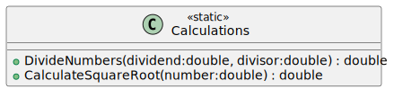

# 12_03

## Klassen



**Methode `DivideNumbers`**

- Voert de deling uit van het dividend door de divisor.
- Genereert een `DivideByZeroException` als de divisor nul is.

**Methode `CalculateSquareRoot`**

- Berekent de vierkantswortel van het opgegeven getal.
- Genereert een `ArithmeticException` als het opgegeven getal negatief is.

## Console applicatie

Vraag de gebruiker om 2 getallen in te geven. Deze getallen mogen kommagetallen zijn met minimum -100 en maximum 100. Bereken volgende resultaten en toon deze aan de gebruiker: de deling van de 2 getallen en het resultaat van de vierkantswortel van deze deling. Indien er zich een exception voordoet tijdens de berekening, toon je de message van de exception aan de gebruiker. Behandel volgende exceptions:

- `DivideByZeroException`
- `ArithmeticException`
- `FormatException`
- `Exception`

## Voorbeelden

```plaintext
Enter the first number: 16
Enter the second number: 4
Result: 4     
Square root: 2
```

```plaintext
Enter the first number: 16
Enter the second number: 0
Error: Division by zero is not allowed
```
